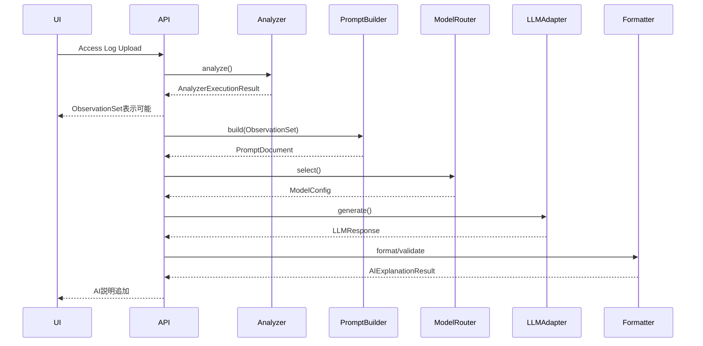

# Project Polaris
# 06_AI_Architecture
## AIアーキテクチャ設計 — Revision 2

---

# 1. 目的

本書はProject PolarisにおけるAIレイヤーの責務、処理フロー、Prompt、Model接続、障害時動作、テスト、安全性を定義する。

Project Polarisは生アクセスログをAIへ渡して自由解析させるサービスではない。

Analyzerが`ObservationSet`を生成し、AIはその観測情報を人間へ説明する。

---

# 2. Revision 2で変更したこと

旧版は`AnalysisResult`をAI入力契約としていた。

また旧Analyzer側で、

```text
Detection Rule
Priority
AnalysisResult
Health Score Input
```

を生成する前提があった。

07/08の改訂により、AI入力契約は`ObservationSet`へ変更する。

正式Pipeline：

```text
Access Log
↓
Analyzer
↓
ObservationSet
├─→ UI / Basic Report
└─→ PromptBuilder
    ↓
   LLM
    ↓
AIExplanationResult
```

Health Scoreは初期実装では採用しない。

AIは`Overall Urgency`を説明結果として生成できるが、これはRisk Scoreではない。

---

# 3. AI Operational Principles

## 3.1 Analyzer First

AIはログ解析・数値集計を行わない。

Analyzerが観測情報を構造化する。

## 3.2 AI is an Explainer

AIの主責務：

- 観測事実の説明
- Known Informationの補足
- 考えられる状況の説明
- 断定できない事項の説明
- Next Check
- Overall Urgency
- クライアント向け言い換え
- レポート文章
- 保存済みObservationSetに対するChat

## 3.3 AI is not a Detector

AIはAnalyzerの代わりに、

```text
新しいLog Count
新しいAggregation
見えていないアクセスの検出
```

を行わない。

## 3.4 User Makes Final Decision

AIは可能性と確認先を示す。

最終判断はユーザーが行う。

---


# 3.5 MVP Input Scope

MVPのAI Explanationが対象とする`ObservationSet`は、Access Log Analyzerが生成したものに限定する。

AIは、

- PHP Error Log
- Application Log
- Authentication Log
- WAF / CDN Event Log
- Server Error Log

を直接解析しない。

これらはAccess Log上のObservationから必要性がある場合に、

```text
次に確認すべきログ
```

として案内する。

例：

```text
/api/orderで500レスポンスが集中しています。
Access Logだけでは原因を確認できないため、
同時間帯のApplication / PHP Error Logを確認してください。
```

AIがError Logを見たかのように説明してはならない。

# 4. AI Layer Boundary

AIレイヤーは次を基本とする。

```text
PromptBuilder
↓
PromptDocument
↓
ModelRouter
↓
LLMAdapter
↓
ResponseFormatter
↓
AIExplanationResult
```

初期実装では独立した以下の層を設けない。

- PromptContextBuilder
- AI Analysis Layer
- AI Pattern Layer
- AI Decision Layer
- AI Response Analyzer
- AI Context Optimizer

ObservationSet自体がAI入力用にSelection / Size Control済みであるため、再選別層を追加しない。

---

# 5. Dependency Direction

```text
AI Layer
  ↓
ObservationSet / AIExplanation Types

Analyzer ─X→ AI Layer
```

AnalyzerはAI ProviderやPromptを知らない。

AIはAnalyzer内部Aggregation型を知らず、公開された`ObservationSet`だけを利用する。

---

# 6. AI Request Lifecycle



Analyzer完了をAI完了待ちにしない。

AI失敗でObservationSetを破棄しない。

---

# 7. AI Input Contract

```typescript
interface AIExplanationInput {
  analyzerStatus:
    | 'success'
    | 'partial';

  observationSet: ObservationSet;

  analyzerErrors: AnalyzerError[];

  analyzerWarnings: AnalyzerWarning[];
}
```

`failed`のAnalyzer結果は通常AI Explanationへ送らない。

---

# 8. ObservationSetの扱い

AIは次を参照できる。

- Source Summary
- Parse Summary
- Availability
- Path Groups
- Source IP Groups
- Source IP × Path Groups
- Status Groups
- Method Groups
- User-Agent Groups
- Time Groups
- Known Information Snapshot
- Truncation
- Redaction Summary
- Exclusion Summary

AIはObservationSetに存在しない事実を「確認した」と言ってはならない。

---

# 9. PromptBuilder

PromptBuilderは通常コードである。

責務：

```text
ObservationSet
+
Prompt Purpose
+
Optional User Question
↓
PromptDocument
```

Interface例：

```typescript
export type PromptPurpose =
  | 'initial_summary'
  | 'explain_finding'
  | 'suggest_check'
  | 'client_explanation'
  | 'report'
  | 'chat';

export interface PromptBuildOptions {
  purpose: PromptPurpose;
  language: 'ja';
  userQuestion?: string;
}

export interface PromptBuilder {
  build(
    input: AIExplanationInput,
    options: PromptBuildOptions
  ): PromptDocument;
}
```

---

# 10. PromptBuilderが行わないこと

- 新しいAggregation
- Detection
- Severity
- Priority
- Risk Score
- Urgencyのコード判定
- Root Cause断定
- Known Information書換
- ObservationSet再ランキング
- Analyzer結果の変更

PromptBuilderは入力を固定Templateへ埋め込む。

---

# 11. PromptDocument

```typescript
export interface PromptDocument {
  systemPrompt: string;
  userPrompt: string;
}
```

初期実装では以下の中間型を追加しない。

```text
PromptContext
PromptFragment
PromptSection
PromptOptimizationResult
```

---

# 12. System Prompt Principles

System Promptでは最低限次を指示する。

```text
ObservationSetを観測根拠とする
FactとInterpretationを分ける
Known Informationを優先する
Project / User情報を一般知識より優先する
Countだけで危険判定しない
Partial / Truncationを考慮する
断定できないことを明示する
Next Checkを示す
Finding Referenceを返す
Overall Urgencyは危険度ではない
Immediateを乱用しない
```

---

# 13. AI Explanation Structure

AIは次の構造で説明する。

```text
Observation
Known Context
Interpretation
Limitation
Next Check
```

Findingは複数Observation Groupを説明上まとめてよい。

Analyzer側のGroup構造を書き換えるものではない。

---

# 14. AIExplanationResult

```typescript
interface AIExplanationResult {
  summary: string;

  overallUrgency: AIUrgencyAssessment;

  findings: AIFinding[];

  overallNotes: string[];

  dataLimitations: string[];
}
```

```typescript
interface AIFinding {
  id: string;
  title: string;
  observation: string;
  interpretation?: string;
  limitation?: string;
  nextChecks: string[];
  references: ObservationReference[];
}
```

Finding単位Urgencyは初期実装では持たない。

---

# 15. Overall Urgency

```typescript
type UrgencyLevel =
  | 'low'
  | 'normal'
  | 'high'
  | 'immediate';

interface AIUrgencyAssessment {
  level: UrgencyLevel;
  reason: string;
  references: ObservationReference[];
  limitations?: string[];
}
```

Urgencyは、

```text
どの程度早く人が確認した方がよいか
```

を表す。

攻撃確率、Risk、Severityではない。

Count Thresholdで機械的に決めない。

---

# 16. Known Information

AIはObservationSetにSnapshotされたKnown Informationを利用する。

優先順位：

```text
user
project
built_in
AI一般知識
```

Known InformationとAI一般知識が競合した場合、Project / User情報を優先する。

Unknown Pathを断定しない。

---

# 17. Partial / Truncation

`partial`の場合、AIは解析欠損を説明へ反映する。

Truncationがある場合、

```text
全アクセスを確認した結果
```

とは言わない。

Parse Warning、Unavailable View、Known Information Failureを推測で補完しない。

---

# 18. Prompt Data Selection

旧版ではPromptBuilder側でAnalysisResultから送信情報を選ぶ設計があった。

Revision 2では、AI入力の主要Selection / Size ControlはAnalyzerがObservationSet生成時に完了している。

そのためPromptBuilderはObservationSetを再ランキングしない。

ProviderのToken上限により最終縮退が必要な場合はTransport層の明示的な入力制約として扱い、

- 何を省略したか
- AIに渡した範囲

を追跡可能にする。

暗黙の意味評価で削除しない。

---

# 19. ModelRouter

ModelRouterはPurpose等からModelConfigを選択する。

```typescript
interface ModelRouter {
  select(purpose: PromptPurpose): ModelConfig;
}
```

ModelRouterはObservationの内容からRiskを判断して高性能Modelへ切り替える等の意味判定を行わない。

---

# 20. LLMAdapter

LLMAdapterはProvider通信だけを担当する。

責務：

- API request
- timeout
- retry
- response取得
- provider error変換

Analyzer / Observationの意味を解釈しない。

---

# 21. ResponseFormatter

ResponseFormatterはLLM Responseを`AIExplanationResult`へ変換・検証する。

行うこと：

- Schema validation
- Enum validation
- Required field確認
- Reference存在確認
- Markdown safety等

行わないこと：

- 新Finding追加
- Urgency再計算
- Observation数値補正
- Root Cause推定
- Finding順の意味的再構成

---

# 22. Output Grounding Validation

最低限確認する。

- FindingにReferenceがある
- Reference先Groupが存在する
- UrgencyにReferenceがある
- Urgency reasonが空でない
- Enumが正しい

将来的にFinding内数値とReference先Group数値の整合検証も追加できる。

---

# 23. AI Failure

AIが失敗してもAnalyzer結果は利用可能。

```text
Analyzer success
AI failed
```

を分離する。

UrgencyをAnalyzerのCountから代替生成しない。

---

# 24. Chat Layer

有料AI Chat等では保存済みObservationSetを根拠に回答する。

Chatも新しいログ解析を行わない。

必要な詳細がObservationSetにない場合、

```text
現在の解析結果からは確認できない
```

と回答する。

将来、生ログDrill-down機能を追加する場合は別設計とする。

---

# 25. Client Explanation / Report

同じObservationSet / AIExplanationResultを利用し、表現Purposeだけを変える。

Report専用Detectionや別Analyzerを作らない。

---

# 26. Free / Paid

Architectureでは具体的なEntitlementを固定しない。

保証すること：

- PlanでAnalyzerのObservationSetを変更しない
- Parse Warning等の解析品質情報を隠さない
- AIを利用しない基本表示が成立する

AI Summary / Urgency / Chat等をどこまで無料提供するかはProduct Planで決定する。

---

# 27. Security

AIへ送信するのはRedaction済みObservationSet。

Raw Sensitive Query ValueをAIへ送らない。

Prompt Injectionの可能性があるPath / UA / Referrer等はDataとして扱い、Instructionとして解釈しないようSystem Promptで明示する。

---

# 28. Testing

## PromptBuilder

- ObservationSetを変更しない
- Purpose別Template
- User Questionの安全な埋め込み

## Grounding

- 存在しないPath / Countを確認済みと説明しない
- Referenceが実在する
- Partial / Truncationを無視しない

## Urgency

- CountだけでLevelを決めない
- Immediate乱用防止
- Lowを安全と説明しない

## Failure

- AI timeout
- malformed JSON
- invalid enum
- missing reference
- provider error

---

# 29. Monitoring

内部Metric候補：

```text
aiRequestCount
aiSuccessCount
aiFailureCount
latency
retryCount
model
purpose
inputBytes / token estimate
outputBytes / token
schemaValidationFailure
```

ユーザーのアクセスログ内容をMonitoring Logへ不用意に複製しない。

---

# 30. 不採用設計

初期実装では採用しない。

- PromptContextBuilder
- AI Detection Layer
- AI Pattern Detector
- AI Risk Scorer
- Health Score
- Finding Severity
- Finding Priority
- AIによるKnown Information自動更新
- 生ログ全量AI送信
- AI失敗時のAnalyzer Score fallback

---

# 31. 09 / 11との関係

本書06はAIレイヤー全体Architectureを定義する。

09はAI Explanationの詳細契約を定義する。

11はOverall Urgencyの詳細を定義する。

競合時はRevision 2以降の06と最新版09 / 11を正とする。

---

# 32. Architecture Summary

```text
ObservationSet
↓
PromptBuilder
↓
PromptDocument
↓
ModelRouter
↓
LLMAdapter
↓
ResponseFormatter
↓
AIExplanationResult
    ├─ Summary
    ├─ Overall Urgency
    ├─ Findings
    └─ Data Limitations
```

AIはAnalyzerの代わりにログを解析しない。

AIはAnalyzerが整理した観測事実を、根拠・可能性・限界・確認事項とともに人間へ説明する。

この責務をProject PolarisにおけるAI Architectureの正式仕様とする。
