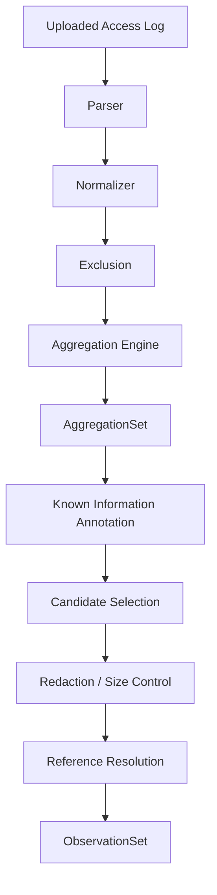

# Project Polaris
# 07_Analyzer_Architecture
## Analyzerアーキテクチャ設計 — Revision 2

---

# 1. 目的

本書はProject PolarisにおけるAnalyzerの責務、処理Pipeline、公開型、障害境界、性能方針を定義する。

Analyzerの目的はアクセスログから攻撃や異常を判定することではない。

大量のアクセスログを、

```text
人間およびAIが扱える
構造化された観測情報
```

へ変換することを目的とする。

Analyzerの最終成果物は`ObservationSet`である。

---

# 2. Revision 2で変更したこと

旧版では次の構造を採用していた。

```text
AggregationResult
↓
Detection Rule
↓
AnalysisResult
↓
Priority / Display Group / Next Action
↓
AnalyzerOutput
```

08以降の設計検証の結果、この構造は採用しない。

理由：

- RuleがPathやCMS等の技術知識を抱えやすい
- Count Thresholdに根拠を持たせにくい
- Severity / PriorityがAnalyzerの意味判断になる
- AI Explanationと責務が重複する
- Countが少なくても重要なObservationを扱いにくい
- 「何を集計したか」と「それをどう解釈するか」が混在する

Revision 2では次へ変更する。

```text
Access Log
↓
Parse
↓
Normalize
↓
Exclusion
↓
Group / Aggregate
↓
Known Information Annotation
↓
Candidate Selection
↓
Redaction / Size Control
↓
Reference Resolution
↓
ObservationSet
```

Detection Rule層は設けない。

---

# 3. Analyzer Mission

Analyzerは次を行う。

- Parse
- Normalize
- Grouping
- Count / Distinct Count / Distribution
- 時間Bucket集計
- Known Informationの付与
- AI入力候補の選出
- Sample制御
- Redaction
- Truncation情報保持
- Parse Warning保持
- ObservationSet生成

Analyzerは次を行わない。

- 攻撃判定
- Bot判定
- Intent判定
- Root Cause判定
- Severity
- Priority
- Risk Score
- Urgency
- Next Action生成
- AI向け結論文生成

---

# 4. AnalyzerとAIの責務分離

```text
Analyzer
= 観測事実を整理する

AI
= 観測事実の意味・可能性・確認事項を説明する

User
= 最終判断する
```

たとえば、

```text
/wp-login.php
5 requests
POST 4
1 source IP
```

をAnalyzerはそのままObservationとして保持する。

Known Informationに一致する場合、

```text
WordPressで一般的にログイン処理に使用されるPath
```

という補助情報を付ける。

Analyzerは、

```text
ブルートフォース
危険
High Priority
```

とは判断しない。

---

# 5. Pipeline



---


# 5.1 MVP Input Scope

MVPではAnalyzer InputをAccess Logに限定する。

```text
AnalyzerInput
= Access Log
```

Error Log、Application Log、Authentication Log等は異なるSchema / Aggregationを必要とするため、Access Log Analyzerへ混在させない。

将来対応する場合も、Access Log用`ObservationSet`を無理に拡張するのではなく、別Input Type / Observation Contractとして設計する。

MVPではこれらをAIの`Next Check`対象として扱う。

# 6. Parser

ParserはLog Lineから取得可能なFieldを抽出する。

代表Field：

```text
timestamp
sourceIp
method
path
query
status
responseSize
referrer
userAgent
duration
```

取得不能Fieldを推測で補完しない。

Partial Parseを許容する。

---

# 7. Normalizer

NormalizerはAggregationに必要な表現統一を行う。

主な責務：

- Path / Query分離
- Timestamp標準化
- Source IP選択
- Method表現統一
- 欠損値の明示

NormalizerはPathの意味を分類しない。

---

# 8. Exclusion

ExclusionはNormalize後、Aggregation前に適用する。

初期対象：

- Path Exact
- Path Prefix
- Source IP

Exclusionは「安全判定」ではない。

分析上不要な既知トラフィックを集計対象から外す設定である。

除外件数は`ExclusionSummary`に保持する。

---

# 9. Aggregation

標準Viewは次の7種類とする。

```text
Path
Source IP
Source IP × Path
Status
Method
User-Agent
Time
```

代表集計：

```text
requestCount
distinctSourceIpCount
distinctPathCount
distinctUserAgentCount
methodDistribution
statusDistribution
queryVariantCount
firstSeen
lastSeen
timeDistribution
topPaths
topSourceIps
```

Countは評価値ではない。

---

# 10. AggregationResult / AggregationSet

内部Aggregation結果はAI公開契約ではない。

```typescript
interface AggregationSet {
  paths: Map<string, MutablePathAggregate>;
  sourceIps: Map<string, MutableSourceIpAggregate>;
  sourceIpPaths: Map<string, MutableSourceIpPathAggregate>;
  statuses: Map<number, MutableStatusAggregate>;
  methods: Map<string, MutableMethodAggregate>;
  userAgents: Map<string, MutableUserAgentAggregate>;
  time: Map<string, MutableTimeAggregate>;
}
```

具体的なMutable型は実装詳細とする。

---

# 11. Known Information

Known Information StoreはAnalyzerとAIの双方で利用できる既知情報を保持する。

Source：

```text
built_in
project
user
```

優先順位：

```text
user > project > built_in
```

初期TargetはPathのみ。

初期Match：

```text
exact
prefix
```

Known Informationは攻撃判定ではない。

---

# 12. Known Information Annotation

MatchingはRaw LineではなくUnique Path Groupに対して行う。

```text
Aggregation
↓
Unique Path
↓
Known Information Match
↓
Annotation
```

一致はCandidate Selectionの理由として利用できる。

Countが1でもKnown Information一致GroupをAI入力候補へ残せる。

---

# 13. Candidate Selection

全Aggregation GroupをAIへ送らない。

観点別に代表Groupを選出する。

例：

```text
Known Information一致
Request Count上位
Distinct Source IP上位
Distinct Path上位
4xx件数上位
5xx件数上位
POST件数上位
Response Size上位
```

Selection Reasonは重要度ではない。

総合Weight Scoreは作らない。

---

# 14. Truncation

Selectionにより省略したGroup数を必ず保持する。

```typescript
interface TruncationItem {
  totalGroups: number;
  selectedGroups: number;
  omittedGroups: number;
}
```

AIはTruncationを認識し、全件確認済みと説明してはならない。

---

# 15. Redaction

ObservationSetにRaw Sensitive Valueを残さない。

初期対象：

```text
password
passwd
pwd
token
access_token
api_key
secret
session
email
phone
```

Query / Referrer Query / Parse Warning Sampleへ適用する。

Redaction不能で安全を保証できない場合はFatalとする。

---

# 16. ObservationSet

Analyzerの唯一の公開解析成果物は`ObservationSet`とする。

```typescript
interface ObservationSet {
  version: string;

  source: ObservationSourceSummary;

  parse: ParseSummary;

  availability: ObservationAvailability;

  groups: ObservationGroups;

  knownInformation: KnownInformationSetSummary;

  truncation: TruncationSummary;

  redaction: RedactionSummary;

  exclusions: ExclusionSummary;
}
```

ObservationSetに次を含めない。

```text
severity
priority
riskScore
urgency
intent
attackType
nextAction
Analyzer生成結論文
```

---

# 17. Group ID / Reference

Selected Groupには一意な`groupId`を持たせる。

初期Relationは最小限とする。

```text
Source IP × Path
  → Path Group
  → Source IP Group
```

Relation Graphは作らない。

---

# 18. Parse Warning

Parse Warningは必須成果物とする。

```text
totalLines
parsedLines
partialLines
failedLines
warning code
count
redacted samples
```

Parseできなかった行数・理由をユーザーから隠さない。

---

# 19. Execution Result

Analyzerの実行状態はObservationSetとは分離する。

```typescript
type AnalyzerExecutionStatus =
  | 'success'
  | 'partial'
  | 'failed';

interface AnalyzerExecutionResult {
  status: AnalyzerExecutionStatus;
  observationSet?: ObservationSet;
  errors: AnalyzerError[];
  warnings: AnalyzerWarning[];
}
```

---

# 20. Partial / Fatal

Partial例：

- 一部行Parse失敗
- Known Information Store unavailable
- 一部Aggregation View失敗
- Safe Sample Drop

Fatal例：

- 全行Parse失敗
- Unsupported Log Format
- Invalid Configuration
- Redaction Safety Failure
- Aggregation全体失敗
- Serialization Failure

失敗を「0件」「問題なし」として扱わない。

---

# 21. Availability

空配列と生成不能を区別する。

```typescript
type ViewAvailability =
  | 'available'
  | 'failed'
  | 'disabled'
  | 'unsupported';
```

---

# 22. Configuration

Analyzer Configurationが制御するもの：

```text
Aggregation View
Selection Top N
Total Group Limit
Sample Limit
Time Bucket
Redaction
Known Information Source
Exclusion
Resource Guard
```

制御しないもの：

```text
Severity Threshold
Attack Threshold
Risk Weight
Priority Weight
Urgency Threshold
```

---

# 23. Streaming / Incremental Aggregation

大量ログを全件Memoryへ保持しない。

```text
Read Line
↓
Parse
↓
Normalize
↓
Exclusion
↓
Aggregate Update
↓
Discard Entry
```

基本計算量はLog Line数に対して`O(n)`を目標とする。

---

# 24. High Cardinality

特に注意するView：

```text
Path
Source IP
Source IP × Path
User-Agent
```

最も高負荷になりやすいのは`Source IP × Path`。

Group Guardを持つ。

Guard超過時にSilent Dropや暗黙Approximationを行わない。

---

# 25. Determinism

同一Input、同一Configuration、同一Known Information Datasetなら同じObservationSetを生成する。

AIの非決定性をAnalyzerへ持ち込まない。

---

# 26. Analyzer API

概念Interface：

```typescript
export interface Analyzer {
  analyze(
    input: AnalyzerInput,
    config: AnalyzerConfiguration
  ): Promise<AnalyzerExecutionResult>;
}
```

Analyzer内部でAIを呼び出さない。

---

# 27. Dependency Direction

```text
UI / API
  ↓
Analyzer
  ↓
ObservationSet Types

AI Layer
  ↓
ObservationSet Types
```

```text
Analyzer ─X→ AI Layer
```

Known Information StoreはAnalyzerから参照するが、AI Providerには依存しない。

---

# 28. Testing

Testingは次の4層で行う。

```text
Unit
Integration
Property
Benchmark / Resource
```

必須Invariant：

- Count Conservation
- Distribution Conservation
- Truncation Consistency
- Determinism
- Sensitive Value非残存
- ObservationSetにSemantic Fieldを持たない

---

# 29. Performance Metrics

内部計測候補：

```text
inputBytes
lineCount
parseDuration
aggregationDuration
knownInformationDuration
selectionDuration
observationSetBuildDuration
peakMemory
peakGroupCount
serializedObservationSetBytes
```

ユーザー向けObservationSetへ必須で含める必要はない。

---

# 30. 不採用設計

初期実装では採用しない。

- Detection Rule
- AnalysisResult
- DetectionResult
- Severity
- Priority
- Display Group
- Health Score Input
- Intent Layer
- Action Layer
- Observation Graph
- Relation Graph
- AIによるKnown Information自動登録
- Threat Intelligence統合
- IP Reputation統合
- Approximate Aggregationへの暗黙移行

---

# 31. 08_Analyzer_Aggregationとの関係

本書07はAnalyzer全体のArchitectureを定義する。

08は以下の詳細仕様を担当する。

- Aggregation View
- ObservationSet
- Known Information Store
- Selection
- Redaction
- Configuration
- Error Handling
- Performance
- Testing

競合時は、Revision 2以降の07と最新版08を正とする。

---

# 32. Architecture Summary

```text
Access Log
↓
Parser / Normalizer
↓
Exclusion
↓
Aggregation
↓
Known Information
↓
Selection
↓
Redaction / Size Control
↓
ObservationSet
├─→ UI / Basic Report
└─→ AI Explanation
```

Analyzerは「何が危険か」を答えない。

Analyzerは「何が観測されているか」を、欠損や省略条件も含めて正確に整理する。

この責務をProject PolarisにおけるAnalyzer Architectureの正式仕様とする。
