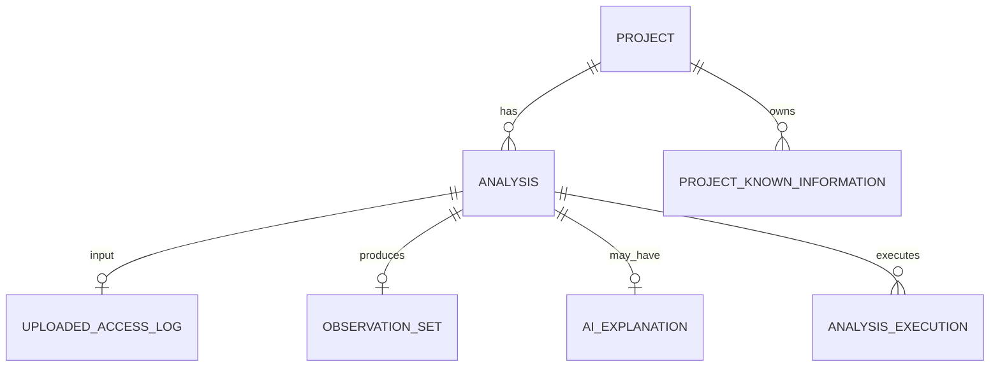

# Project Polaris
# 13_Analysis_Data_Model
## 解析データモデル設計

---

# 1. 目的

本書では、Project Polarisにおける解析データの保存単位、Entity間の関係、解析履歴、Raw Access Log、ObservationSet、AIExplanationResult、Known Informationの関連を定義する。

対象はMVPのAccess Log解析である。

本章ではUIやAPIの詳細は扱わない。

目的は、以下を実装可能なデータ構造として固定することである。

```text
Project / Site
Analysis
Uploaded Access Log
ObservationSet
AIExplanationResult
Known Information
Analysis History
```

---

# 2. 基本方針

## 2.1 Analysisを中心Entityとする

Polarisでは、

```text
1回のAccess Log解析
```

を`Analysis`として扱う。

Analysisは、

- どのProject / Siteに対する解析か
- どのAccess Logを入力したか
- Analyzerがどの状態で終了したか
- ObservationSetが生成されたか
- AI Explanationが生成されたか

をまとめる単位である。

---

## 2.2 ProjectとAnalysisを分離する

`Project`は継続的に利用する対象サイト・案件を表す。

`Analysis`はそのProjectで実行された個々の解析を表す。

```text
Project
├─ Analysis A
├─ Analysis B
├─ Analysis C
└─ ...
```

これにより、

- 解析履歴
- 前回比較
- 保守レポート
- Known InformationのProject設定

を将来実装できる。

---

## 2.3 Analyzer結果とAI結果を分離する

ObservationSetとAIExplanationResultは別Entityとして扱う。

```text
Analysis
├─ ObservationSet
└─ AIExplanationResult
```

AIが失敗してもObservationSetは有効である。

AI結果が存在しないAnalysisも正常に成立する。

---

# 3. Entity Overview

```text
User / Account
  ↓
Project
  ↓
Analysis
  ├─ UploadedAccessLog
  ├─ ObservationSet
  ├─ AIExplanationResult
  └─ AnalysisExecution

Project
  └─ ProjectKnownInformation

User / Organization
  └─ UserKnownInformation

System
  └─ BuiltInKnownInformation
```

MVPではUser / Organizationの詳細認証モデルは別章とする。

---

# 4. Project

## 4.1 役割

Projectは解析対象サイトまたは案件の単位である。

例：

```text
Client A Corporate Site
example.com
採用サイト
キャンペーンLP
```

1つのドメインに限定する必要はない。

---

## 4.2 Project Interface

```typescript
interface Project {
  id: string;

  name: string;

  description?: string;

  site?: {
    primaryUrl?: string;
    hostname?: string;
  };

  status:
    | 'active'
    | 'archived';

  createdAt: string;

  updatedAt: string;
}
```

MVPではProjectに複雑なCMS設定等を持たせない。

CMS固有情報が必要な場合はKnown Informationで管理する。

---

# 5. Analysis

## 5.1 役割

Analysisは1回の解析実行を表す。

```typescript
interface Analysis {
  id: string;

  projectId: string;

  status: AnalysisStatus;

  createdAt: string;

  startedAt?: string;

  completedAt?: string;

  analyzerStatus?: AnalyzerExecutionStatus;

  aiStatus?: AIExecutionStatus;

  inputLogId?: string;

  observationSetId?: string;

  aiExplanationResultId?: string;

  metadata: AnalysisMetadata;
}
```

---

## 5.2 AnalysisStatus

Top LevelのAnalysis StatusはWorkflow全体の状態を表す。

```typescript
type AnalysisStatus =
  | 'created'
  | 'uploaded'
  | 'analyzing'
  | 'analyzed'
  | 'explaining'
  | 'completed'
  | 'partial'
  | 'failed';
```

ただしAnalyzerとAIの状態は別々に保持する。

例：

```text
AnalysisStatus = completed
Analyzer = success
AI = failed
```

のような状態を表現可能にする。

Analysis Statusだけで詳細Failureを表そうとしない。

---

# 6. Analysis Metadata

```typescript
interface AnalysisMetadata {
  originalFileName?: string;

  fileSizeBytes?: number;

  detectedLogFormat?: string;

  period?: {
    firstSeen?: string;
    lastSeen?: string;
  };

  totalLineCount?: number;

  totalRequestCount?: number;

  observationSetVersion?: string;

  analyzerConfigurationVersion?: string;

  knownInformationDatasetVersion?: string;
}
```

一覧画面等でObservationSet全体を読み込まなくても概要を表示できるよう、必要なSummaryをAnalysis Metadataへ保持できる。

ただしObservationSetの正本をAnalysisへ複製しない。

---

# 7. UploadedAccessLog

## 7.1 役割

UploadedAccessLogはユーザーが投入したAccess Log Fileを表す。

```typescript
interface UploadedAccessLog {
  id: string;

  analysisId: string;

  originalFileName: string;

  sizeBytes: number;

  mimeType?: string;

  storageKey?: string;

  checksum?: string;

  status:
    | 'uploaded'
    | 'processing'
    | 'deleted'
    | 'expired';

  createdAt: string;

  expiresAt?: string;

  deletedAt?: string;
}
```

---

# 8. Raw Access Logの保存方針

## 8.1 基本原則

Raw Access LogはPolarisにおいて最もSensitiveなデータの1つである。

含まれる可能性があるもの：

- IP Address
- Query Parameter
- Referer
- User-Agent
- Token
- Email
- Tracking ID
- Session ID

そのため、

```text
長期保存を前提にしない
```

ことを基本方針とする。

---

## 8.2 MVP推奨方針

MVPでは、

> **解析処理に必要な期間だけRaw Access Logを一時保存し、Analyzer完了後に削除する**

ことを推奨する。

```text
Upload
↓
Temporary Storage
↓
Analyzer
↓
ObservationSet生成
↓
Raw Log削除
```

AIはRaw LogではなくObservationSetを利用するため、AI Explanation生成後までRaw Logを保持する必要はない。

---

## 8.3 Raw Logを保存しない理由

### Security

個人情報やCredential等を含む可能性がある。

### Cost

大規模Logを解析履歴ごとに保存するとStorage Costが増える。

### Product Value

PolarisはLog Archiveサービスではない。

### Architecture

ObservationSetが解析後の永続成果物となる。

---

## 8.4 再解析とのTrade-off

Raw Logを削除すると、

```text
Analyzer Algorithm更新後に同じRaw Logを再解析する
```

ことはできない。

再解析したい場合はユーザーがLogを再アップロードする。

MVPではこのTrade-offを受け入れる。

将来、

```text
Raw Logを一定期間保存するPro機能
```

等を設ける場合は、Storage / Security / Product Planで別途設計する。

---

# 9. Raw Log Retention State

UploadedAccessLogでは削除状態を明示する。

例：

```text
uploaded
processing
expired
deleted
```

Analysis履歴が残っていてもRaw Logが削除済みであることを表現できる。

---

# 10. ObservationSet Record

## 10.1 役割

ObservationSetはAnalyzerの永続的な解析成果物である。

```typescript
interface ObservationSetRecord {
  id: string;

  analysisId: string;

  schemaVersion: string;

  data: ObservationSet;

  createdAt: string;
}
```

MVPではObservationSetをJSONとして保存可能な構造とする。

---

## 10.2 ObservationSetを正本とする

解析結果の正本はObservationSetとする。

UIやAIのために別の意味的解析結果を正本として保存しない。

```text
ObservationSet
= Analyzer Result Source of Truth
```

---

# 11. ObservationSet保存理由

Raw Log削除後でも、

- Aggregation View
- Data Limitation
- AI Explanation再表示
- Report再生成
- AI Chat
- Analysis History

を利用できる。

---

# 12. ObservationSet更新

ObservationSetは原則Immutableとする。

同じAnalysis内で後から書き換えない。

Analyzerを再実行した場合は、

```text
新しいAnalysis
```

として扱うことをMVPの基本とする。

理由：

- 再現性
- AI Explanationとの整合
- Reportとの整合
- Known Information Snapshotとの整合

---

# 13. AIExplanationResult Record

```typescript
interface AIExplanationRecord {
  id: string;

  analysisId: string;

  schemaVersion: string;

  modelInfo: AIModelInfo;

  data: AIExplanationResult;

  createdAt: string;
}
```

---

# 14. AI Model Info

```typescript
interface AIModelInfo {
  provider: string;

  model: string;

  promptVersion: string;
}
```

AI ExplanationはModel / Prompt Versionの影響を受けるため、最低限追跡可能にする。

---

# 15. AI Explanationの再生成

ObservationSetが保存されていれば、Raw LogなしでもAI Explanationを再生成可能。

例：

```text
ObservationSet
↓
New Prompt Version
↓
AI Explanation v2
```

ただしMVPでは1 Analysisに対して最新1件だけ保持するか、複数Versionを保持するかは実装簡略性を優先して決める。

推奨：

```text
MVP
= 最新AI Explanation 1件
```

将来Historyが必要になればVersioningする。

---

# 16. AI Status

```typescript
type AIExecutionStatus =
  | 'not_requested'
  | 'queued'
  | 'running'
  | 'success'
  | 'failed';
```

AI利用なしのAnalysisを正常状態として扱える。

---

# 17. Analysis Execution

## 17.1 役割

解析Jobの実行情報はAnalysis本体から分けられる。

```typescript
interface AnalysisExecution {
  id: string;

  analysisId: string;

  type:
    | 'analyzer'
    | 'ai_explanation';

  status:
    | 'queued'
    | 'running'
    | 'success'
    | 'partial'
    | 'failed';

  attempt: number;

  startedAt?: string;

  completedAt?: string;

  errorCode?: string;

  errorMessage?: string;

  createdAt: string;
}
```

---

# 18. なぜExecutionを分けるか

将来的に、

- Queue
- Retry
- Timeout
- Analyzer成功 / AI失敗
- AI再生成

を扱いやすくするため。

ただしMVP実装でDB Tableを必ず分離することまでは要求しない。

Logical Modelとして分離しておく。

---

# 19. Known Information Model

Known InformationはAnalysis単位ではなく、設定Sourceごとに管理する。

```text
System Built-in
Project
User / Organization
```

---

## 19.1 ProjectKnownInformation

```typescript
interface ProjectKnownInformation {
  id: string;

  projectId: string;

  targetType: 'path';

  value: string;

  matchType:
    | 'exact'
    | 'prefix';

  label: string;

  description: string;

  technology?: string;

  commonPurpose?: string;

  enabled: boolean;

  createdAt: string;

  updatedAt: string;
}
```

---

## 19.2 UserKnownInformation

User / Organization ScopeのSchemaはProject版と同じ基本形を利用できる。

Account Model確定後にOwner Scopeを定義する。

---

## 19.3 Built-in Known Information

Built-in DatasetはApplication ResourceとしてVersion管理する。

必ずしもDB Entityにする必要はない。

```text
Static JSON
Application Package
```

等で開始可能。

---

# 20. Known Information Snapshot

Analysis実行時に一致したKnown InformationはObservationSetへSnapshotとして保存する。

そのためProject Known Informationを後から変更しても過去Analysisは変化しない。

---

# 21. Project削除とAnalysis

Projectを削除する場合、

```text
Project
Analysis
ObservationSet
AIExplanation
Uploaded Log
Known Information
```

の扱いを定義する必要がある。

MVPではHard Deleteより、

```text
Project Archived
```

を基本とする案が安全。

実データ削除は明示的Delete操作としてStorage / Retention章で定義する。

---

# 22. Analysis削除

ユーザーはAnalysis履歴を削除できるようにする。

削除対象：

```text
Analysis Metadata
ObservationSet
AIExplanationResult
残っているRaw Log
Execution Log
```

Project Known Informationは削除しない。

---

# 23. Analysis History

HistoryはProject配下のAnalysis一覧で表現する。

一覧に必要な情報例：

```text
Analysis Date
Log Period
Request Count
Analyzer Status
AI Status
Overall Urgency
Warning有無
```

Overall UrgencyはAI Explanationが存在する場合のみ表示可能。

---

# 24. Comparison

前回比較はMVP Coreでは必須としない。

将来Comparisonを行う場合もRaw Log同士ではなく、

```text
ObservationSet A
vs
ObservationSet B
```

を基本とする。

ただしSelection / Truncationがあるため、単純なObservationSetだけで完全比較できるとは限らない。

Comparison設計は別途必要。

---

# 25. Raw Aggregation Snapshotの検討

ObservationSetはAI入力用にSelectionされたGroupを含む。

将来正確な履歴比較をしたい場合、

```text
全Aggregation Group
```

が必要になる可能性がある。

しかしMVPで全AggregationSetを永続保存するとStorage量が増える。

そのためMVPでは、

```text
ObservationSetのみ保存
```

とする。

将来Comparison要件が強くなった時点で、

```text
Compact Aggregation Snapshot
```

を別途検討する。

---

# 26. Important Design Trade-off

ここは重要な設計判断である。

```text
MVP:
Raw Log削除
ObservationSetのみ永続保存
```

を採用すると、

メリット：

- Security Risk低減
- Storage Cost低減
- Architecture単純化
- AI Chat / Reportには十分

デメリット：

- Analyzer再実行不可
- 全Group比較不可
- 新しいDetection / Aggregation軸を過去Logへ適用不可

MVPでは前者を優先する。

---

# 27. Data Relationships



User / OrganizationはAuthentication章で追加する。

---

# 28. Minimal MVP Tables

実装上の最小構成候補：

```text
projects
analyses
uploaded_access_logs
observation_sets
ai_explanations
project_known_information
```

`analysis_executions`はQueue / Retry実装次第で追加する。

Built-in Known InformationはStatic Datasetでよい。

---

# 29. Analyses Table Example

```text
id
project_id
status
analyzer_status
ai_status
input_log_id
observation_set_id
ai_explanation_id
original_file_name
file_size_bytes
detected_log_format
first_seen
last_seen
total_line_count
total_request_count
created_at
started_at
completed_at
```

DB設計時に正規化・Indexを調整する。

---

# 30. Storage Boundary

DBに保存する：

```text
Project Metadata
Analysis Metadata
ObservationSet
AIExplanationResult
Known Information
Execution Status
```

Object Storage等へ一時保存する：

```text
Raw Access Log
```

Raw Access LogをDB BLOBとして保存しない。

---

# 31. Data Security Classification

## High Sensitivity

```text
Raw Access Log
```

## Medium Sensitivity

```text
ObservationSet
IP Address
Path
User-Agent
Known Information
```

## Application Data

```text
Project Name
Analysis Status
Execution Metadata
```

詳細なEncryption / Retentionは15章で設計する。

---

# 32. AI Chatとの関係

AI Chatは保存済み、

```text
ObservationSet
AIExplanationResult
```

をContextとして利用する。

Raw Access Logは利用しない。

そのためRaw Log削除後もChatは成立する。

ObservationSetにない情報については、

```text
現在の解析結果からは確認できない
```

と回答する。

---

# 33. Report Exportとの関係

PDF / Markdown Reportも、

```text
Analysis Metadata
ObservationSet
AIExplanationResult
```

から生成する。

Raw Access LogをReport生成に再利用しない。

---

# 34. Deletion Principle

ユーザーがProject / Analysisを削除できることを前提とする。

Raw LogについてはAnalyzer終了後の自動削除を基本とする。

Persistent Dataについては15_Storage_Retention_Securityで、

- Retention
- User Delete
- Account Delete
- Backup
- Physical Delete

を詳細化する。

---

# 35. MVP確定事項

1. `Analysis`を1回の解析単位とする。
2. Project配下にAnalysis履歴を持つ。
3. Analyzer結果とAI結果を分離する。
4. ObservationSetをAnalyzer Resultの正本とする。
5. AIなしのAnalysisも正常に成立する。
6. MVP InputはAccess Logのみ。
7. Raw Access Logは一時保存とする。
8. Analyzer完了後のRaw Log削除を基本方針とする。
9. Raw Log削除後もObservationSet / AI Resultは保持可能。
10. Raw Log削除後のAnalyzer再実行は行わない。
11. 再解析には再アップロードが必要。
12. ObservationSetは原則Immutable。
13. Analyzer再実行は新Analysisとして扱う。
14. AI ExplanationはObservationSetから再生成可能。
15. Known InformationはProject / User / Built-in Scopeを持つ。
16. 一致Known InformationはObservationSetへSnapshotする。
17. AI Chat / ReportはRaw Logに依存しない。
18. MVPではObservationSetのみを解析履歴として保存する。
19. 全Aggregation Snapshot保存は将来Comparison要件で再検討する。
20. Raw LogをDB BLOBとして保存しない。

---

# 36. 次の設計対象

Data Modelが固まったため、次は、

```text
14_Analysis_Lifecycle_API
```

を設計する。

対象：

```text
Upload
Analysis作成
File Validation
Analyzer Job
ObservationSet保存
Raw Log削除
AI Job
AI失敗
Result取得
Retry
Delete
```

特に、

```text
Analyzer成功
↓
ObservationSet保存
↓
Raw Log削除
↓
AI実行
```

という順序を正式なLifecycleとして定義する。
