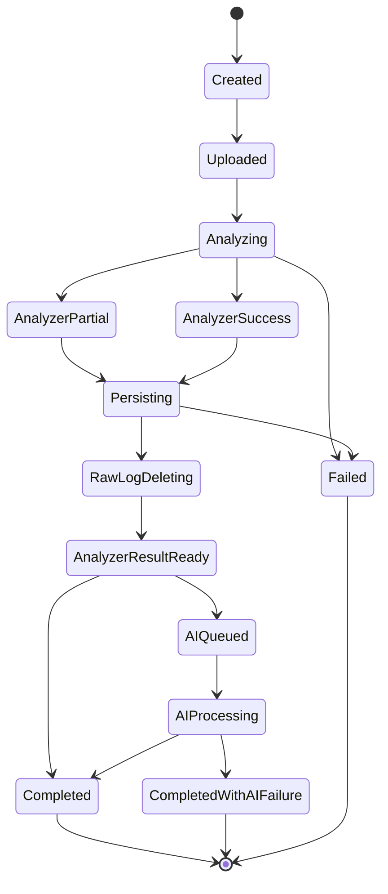

# Project Polaris
# 14_Analysis_Lifecycle_API
## 解析ライフサイクル・API設計

---

# 1. 目的

本書では、Project Polarisにおける1回のAnalysisが、

```text
作成
↓
Access Log Upload
↓
File Validation
↓
Analyzer実行
↓
ObservationSet保存
↓
Raw Access Log削除
↓
AI Explanation実行
↓
結果表示
```

へ進むLifecycleと、そのAPI境界を定義する。

対象はMVPのAccess Log解析である。

---

# 2. 基本原則

1. AnalyzerをAIより先に完了させる。
2. ObservationSet保存成功後にRaw Logを削除する。
3. AIはRaw Logを利用しない。
4. AI失敗でAnalyzer結果を破棄しない。
5. Raw Log削除後のAnalyzer再実行は行わない。
6. 再解析は新Analysis + 再Uploadとする。

---

# 3. Top Level Lifecycle



---

# 4. Analysis Status

```typescript
type AnalysisStatus =
  | 'created'
  | 'uploaded'
  | 'analyzing'
  | 'analyzer_result_ready'
  | 'explaining'
  | 'completed'
  | 'partial'
  | 'failed';
```

Analyzer / AIの状態は別Fieldで保持する。

```typescript
interface AnalysisExecutionState {
  status: AnalysisStatus;

  analyzerStatus?:
    | 'queued'
    | 'running'
    | 'success'
    | 'partial'
    | 'failed';

  aiStatus:
    | 'not_requested'
    | 'queued'
    | 'running'
    | 'success'
    | 'failed';
}
```

---

# 5. Analysis作成

```text
POST /projects/{projectId}/analyses
```

レスポンス例：

```json
{
  "analysisId": "analysis_123",
  "status": "created"
}
```

Upload前にAnalysisを作成する。

---

# 6. Access Log Upload

```text
POST /analyses/{analysisId}/upload
```

multipart/form-dataを想定。

Upload時に最低限確認する。

- File存在
- Empty File
- File Size
- Analysis所有者
- Analysis Status

拡張子だけでAccess Logかを判定しない。

---

# 7. File Validation

Validationは2段階に分ける。

## Upload Validation

- File Size Limit超過
- 空File
- Upload失敗

## Parser Validation

- Unsupported Log Format
- 全行Parse不能

Upload成功とAnalyzer解析可能は別である。

---

# 8. Upload成功後

```text
Analysis.status = uploaded
UploadedAccessLog.status = uploaded
```

Raw LogはTemporary Storageへ保存する。

Upload成功後、Analyzerを自動開始する。

---

# 9. Analyzer Job

Analyzer Jobは以下を実行する。

```text
1. Raw Log取得
2. Analyzer Configuration取得
3. Known Information取得
4. Streaming Parse
5. Normalize
6. Exclusion
7. Aggregation
8. Known Information Annotation
9. Candidate Selection
10. Redaction / Size Control
11. Reference Resolution
12. ObservationSet生成
13. ObservationSet保存
```

---

# 10. Analyzer Status

開始時：

```text
Analysis.status = analyzing
AnalyzerStatus = running
UploadedAccessLog.status = processing
```

---

# 11. Analyzer success

```text
AnalyzerStatus = success
```

ObservationSet保存成功後、

```text
Analysis.observationSetId
```

を設定する。

---

# 12. Analyzer partial

一部Parse失敗等でもObservationSetが成立する場合：

```text
AnalyzerStatus = partial
Analysis.status = partial
```

ObservationSetを保存する。

AI Explanationも実行可能。

Analyzer Warning / Error SummaryをAIへ渡す。

---

# 13. Analyzer failed

Fatal例：

- Unsupported Format
- 全行Parse失敗
- Invalid Configuration
- Redaction Safety Failure
- Aggregation全体失敗
- ObservationSet Serialization Failure

結果：

```text
AnalyzerStatus = failed
Analysis.status = failed
```

ObservationSetを正常成果物として保存しない。

AIは実行しない。

---

# 14. ObservationSet Persist

AnalyzerがObservationSetを生成できても、保存できなければResult Readyではない。

```text
Analyzer生成成功
↓
ObservationSet Persist成功
↓
Analyzer Result Ready
```

保存Failure時にRaw Logを削除してはならない。

---

# 15. Raw Log削除

```text
ObservationSet Persist Success
↓
Raw Log Delete
```

AI実行前に削除してよい。

削除Failureは別Statusで追跡する。

```typescript
type RawLogDeletionStatus =
  | 'pending'
  | 'success'
  | 'failed';
```

削除FailureはRetry対象。

---

# 16. Analyzer Result Ready

ObservationSet保存成功後、

```text
Analysis.status = analyzer_result_ready
```

とする。

この時点でBasic UI / Aggregation Viewを表示可能。

AIを使わない場合はCompletedへ進める。

---

# 17. AI Execution Decision

AI実行は、

- Entitlement
- Usage Limit
- User Request
- Product Plan

等で決定する。

Analyzerはこの判断を行わない。

---

# 18. AI Job

入力：

```text
ObservationSet
Analyzer Status
Analyzer Errors / Warnings
Prompt Purpose
```

Raw Access Logは取得しない。

開始時：

```text
Analysis.status = explaining
AIStatus = running
```

---

# 19. AI success

```text
AIStatus = success
AIExplanationResult保存
Analysis.aiExplanationResultId設定
Analysis.status = completed
```

---

# 20. AI failed

例：

- Provider Timeout
- Rate Limit
- Invalid Response
- Schema Validation Failure
- Reference Validation Failure

結果：

```text
AIStatus = failed
Analysis.status = completed
```

Analyzer結果があるためTop Level Analysisをfailedにしない。

---

# 21. AI Retry

AI RetryはObservationSetを使う。

Raw Log再Uploadは不要。

Retry対象：

- Timeout
- Temporary Provider Error
- Rate Limit
- Malformed Response

Retry回数には上限を持つ。

---

# 22. Analyzer Retry

Raw Log削除後は同一AnalysisでAnalyzer Retryできない。

Analyzer RetryはRaw LogがTemporary Storageに存在する間だけ可能。

MVPではInfrastructure Error / Persist Error等の一時的Failureのみ内部Retry対象とする。

Algorithm更新後の再解析は新Analysis + 再Uploadとする。

---

# 23. Retry Policy

Stage別に分ける。

```text
Upload Retry
Analyzer Internal Retry
ObservationSet Persist Retry
Raw Log Delete Retry
AI Retry
```

一括Retry APIにしない。

---

# 24. Result Retrieval

## Summary

```text
GET /analyses/{analysisId}
```

返却候補：

- Analysis Metadata
- Status
- Analyzer Status
- AI Status
- Request Count
- Log Period
- Warning有無
- Overall Urgency（存在時）

## ObservationSet

```text
GET /analyses/{analysisId}/observations
```

## AI Explanation

```text
GET /analyses/{analysisId}/explanation
```

AI未生成 / 失敗状態を明示する。

---

# 25. Aggregation View API

UIで個別Viewが必要な場合：

```text
GET /analyses/{analysisId}/observations/paths
GET /analyses/{analysisId}/observations/source-ips
GET /analyses/{analysisId}/observations/statuses
```

API層でObservationSetからProjectionする。

---

# 26. Analysis List

```text
GET /projects/{projectId}/analyses
```

一覧用Summaryのみ返す。

例：

```json
[
  {
    "id": "analysis_123",
    "requestCount": 12500,
    "analyzerStatus": "success",
    "aiStatus": "success",
    "overallUrgency": "high",
    "hasWarnings": false
  }
]
```

---

# 27. Delete

```text
DELETE /analyses/{analysisId}
```

削除対象：

- Analysis
- ObservationSet
- AIExplanationResult
- 残存Raw Log
- Execution Records

Project Known Informationは削除しない。

---

# 28. Project Archive

MVPではProjectはArchiveを基本とする。

Archived Projectでは新規Analysisを作成できない。

完全Deleteは別操作とする。

---

# 29. Idempotency / Concurrency

1 Analysisにつき、

```text
Analyzer Job = 最大1
AI Explanation Job = 最大1
```

を基本とする。

同一AnalysisでAnalyzer二重起動を防ぐ。

Job Lock / Status Compare-And-Set等を利用する。

---

# 30. 不正Status Transition

次のようなTransitionを拒否する。

```text
completed
↓
analyzing
```

再解析は新Analysisとする。

---

# 31. API ErrorとJob Failure

```text
HTTP Error
= API Request自体の失敗

Analysis.status = failed
= 非同期解析Jobの失敗
```

Job Failureを常にHTTP Errorとして扱わない。

---

# 32. Polling

MVPではFrontend Pollingで成立する。

```text
GET /analyses/{id}
```

を数秒間隔で取得。

WebSocket / SSEは初期必須にしない。

---

# 33. Progress

正確なPercentageは初期必須にしない。

Stageだけ表示可能にする。

```text
uploaded
analyzing
analyzer_result_ready
explaining
completed
```

---

# 34. Timeout

StageごとにTimeoutを設定する。

- Upload
- Analyzer
- AI
- Storage

Analyzer Timeout時に中途半端なObservationSetを正常保存しない。

---

# 35. Cleanup Job

Raw Log削除Failureや途中中断に備えてTemporary Cleanup Jobを持つ。

```text
expiresAt超過
↓
Raw Log Delete
```

Sensitive Dataが残り続けないようにする。

---

# 36. Orphan Data

定期Cleanup候補：

- AnalysisなしUploadedAccessLog
- AnalysisなしObservationSet
- 期限切れRaw Log
- 失敗Temporary File

---

# 37. Ownership

APIはProject / Analysisの所有権を必ず確認する。

Authentication詳細は17章で定義する。

---

# 38. Raw Log Access

Raw Access LogをPolarisから再Downloadする機能はMVPでは提供しない。

PolarisをLog Storageとして使わせない。

---

# 39. AI Input Boundary

AIへ渡すのは`AIExplanationInput`のみ。

Raw Log Storage KeyをAI Layerへ渡さない。

---

# 40. Observability

内部監視候補：

- Upload Success / Failure
- Analyzer Queue Wait
- Analyzer Duration
- Analyzer Failure
- ObservationSet Persist Failure
- Raw Log Delete Failure
- AI Duration
- AI Failure
- Retry Count
- Cleanup Failure

Raw Log本文をApplication Logへ出さない。

---

# 41. Lifecycle Example: Success

```text
1. Analysis Created
2. Access Log Uploaded
3. Analyzer Running
4. ObservationSet Generated
5. ObservationSet Persisted
6. Raw Log Deleted
7. Analyzer Result Displayable
8. AI Explanation Running
9. AIExplanationResult Persisted
10. Completed
```

---

# 42. Lifecycle Example: Analyzer Partial

```text
1. 100,000 Lines Upload
2. 99,750 Parsed
3. 250 Failed
4. ObservationSet Generated
5. Parse Warning保存
6. Raw Log Deleted
7. AIへpartial情報を渡す
8. AIがData Limitationを説明
9. Completed / Partial
```

---

# 43. Lifecycle Example: AI Failure

```text
1. Analyzer Success
2. ObservationSet Saved
3. Raw Log Deleted
4. AI Provider Timeout
5. AIStatus = failed
6. Aggregation UIは利用可能
7. 必要ならAI Retry
```

---

# 44. Lifecycle Example: Persist Failure

```text
1. AnalyzerがObservationSet生成
2. DB Persist失敗
3. Raw Logを削除しない
4. Persist Retry
5a. 成功 → Raw Log削除
5b. Retry上限 → Analysis Failed
6. Cleanup PolicyによりRaw Log削除
```

---

# 45. API Summary

```text
POST   /projects/{projectId}/analyses
POST   /analyses/{analysisId}/upload

GET    /analyses/{analysisId}
GET    /analyses/{analysisId}/observations
GET    /analyses/{analysisId}/explanation

GET    /projects/{projectId}/analyses

POST   /analyses/{analysisId}/explanation/retry

DELETE /analyses/{analysisId}
```

Analyzer開始はUpload後のInternal Workflowとし、Public APIとして必須にしない。

---

# 46. MVP確定事項

1. Analysis作成後にAccess LogをUploadする。
2. Upload成功後Analyzerを自動開始する。
3. AnalyzerをAIより先に完了させる。
4. ObservationSet保存成功後にRaw Logを削除する。
5. AIはRaw Logを利用しない。
6. Analyzer partialでもObservationSetが成立すれば表示可能。
7. Analyzer FatalではAIを実行しない。
8. AI失敗でAnalyzer結果を破棄しない。
9. AI RetryはObservationSetから行う。
10. Raw Log削除後のAnalyzer Retryは行わない。
11. 再解析は新Analysis + 再Uploadとする。
12. Analysis StatusとAnalyzer / AI Statusを分離する。
13. Job FailureとHTTP Errorを分離する。
14. MVPではPollingで状態取得可能とする。
15. Progress Percentageは初期必須にしない。
16. Raw Log Cleanup Jobを持つ。
17. Raw Log再Download機能はMVPでは持たない。
18. API LayerでOwnershipを必ず確認する。
19. ObservationSetをAnalyzer成果物の正本とする。
20. AI InputはObservationSetベースのみとする。

---

# 47. 次の設計対象

次は、

```text
15_Storage_Retention_Security
```

を設計する。

対象：

- Temporary Raw Log Storage
- Retention
- Automatic Delete
- ObservationSet Retention
- AI Result Retention
- Encryption
- IP Address / Personal Data
- Query Redaction
- AI Provider送信
- Backup
- User Delete
- Account Delete
- Security Logging
