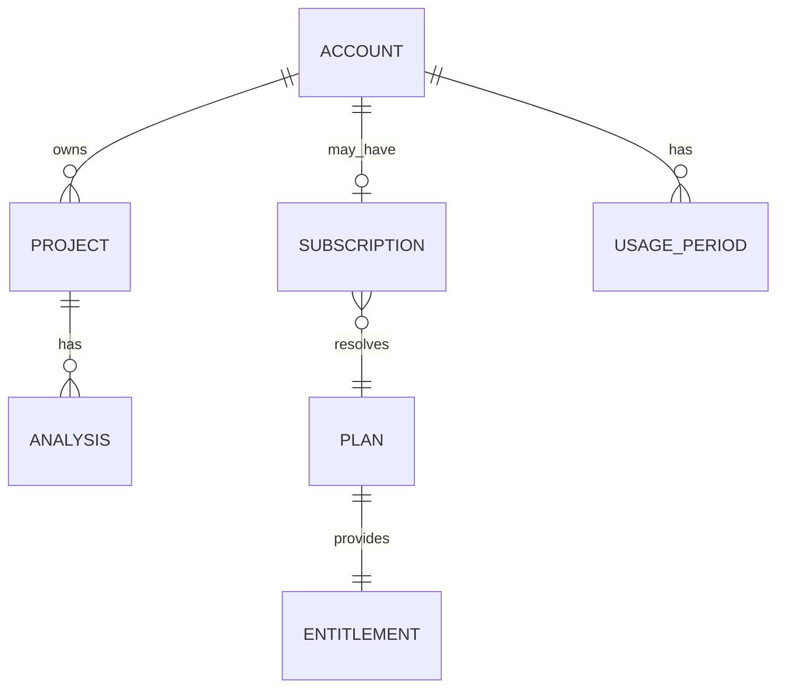

# Project Polaris
# 17_Authentication_Billing
## アカウント・認証・課金・Entitlement設計

# 1. 目的
Project PolarisのAccount、Authentication、Project Ownership、Plan、Subscription、Entitlement、Usage、Upgrade / Downgrade、Payment Failure、Account Deleteを定義する。

最重要原則：

> Analyzer CoreへAccount / Plan / Billingロジックを入れない。

# 2. 基本構造

```text
Account
↓
Subscription / Plan
↓
Entitlement
↓
Application Layer
↓
Analyzer / AI
```

Free Userも正式なAccountを持つ。Payment状態とData Retentionは分離し、DowngradeやPayment Failureで過去Analysisを即削除しない。

# 3. Account

```typescript
interface Account {
  id: string;
  email: string;
  emailVerifiedAt?: string;
  status: 'active' | 'suspended' | 'deletion_pending' | 'deleted';
  createdAt: string;
  updatedAt: string;
}
```

MVPは個人Accountを基本とし、Organization / Teamは対象外とする。Polaris利用に不要な住所・電話・会社名・部署・役職等は原則収集しない。

# 4. Authentication

MVP候補：

```text
Email + Password
または
Email Magic Link
```

Google等のSocial Loginは必須ではない。

Password Hashing、Reset、Email Verification、Session Security等の独自実装を減らすため、Managed Authentication Service利用を推奨する。Providerは技術選定時に確定する。

# 5. Email Verification

Analysis実行前にEmail Verificationを要求する方向を推奨する。

目的：

- 捨てAccount対策
- Free AI Abuse対策
- Account Ownership確認
- Password Reset

# 6. Session

最低限考慮する。

```text
Secure
HttpOnly
SameSite
Expiration
Rotation
Logout
```

Cookie Sessionの場合はCSRF対策を行う。

# 7. Project Ownership

```typescript
interface ProjectOwnership {
  projectId: string;
  ownerAccountId: string;
}
```

すべてのAnalysisはProjectを通じてAccountへ帰属する。

APIでは、

```text
Authenticated Account
↓
Project Ownership
↓
Analysis.projectId
```

を必ず確認する。UUIDだけにSecurityを依存しない。

# 8. Plan

MVP：

```typescript
type PlanCode = 'free' | 'pro';
```

Plan名をAnalyzerや各UIへ直接Hard Codeしない。

# 9. Subscription

```typescript
interface Subscription {
  id: string;
  accountId: string;
  planCode: PlanCode;
  status: 'active' | 'trialing' | 'past_due' | 'canceled' | 'expired';
  provider?: string;
  providerCustomerId?: string;
  providerSubscriptionId?: string;
  currentPeriodStart?: string;
  currentPeriodEnd?: string;
  cancelAtPeriodEnd: boolean;
  createdAt: string;
  updatedAt: string;
}
```

Paid Subscriptionが有効ならPro、存在しなければFreeを基本とする。

毎RequestでPayment Providerへ問い合わせず、Application DBへ同期したSubscription状態からEntitlementを解決する。

# 10. Entitlement

```typescript
interface Entitlement {
  maxProjects: number;
  maxAnalysesPerPeriod: number;
  maxUploadBytes: number;
  maxHistoryItems: number;
  aiSummary: boolean;
  aiChat: boolean;
  aiRegeneration: boolean;
  reportExport: boolean;
  csvExport: boolean;
}
```

```text
Account
↓
Subscription State
↓
Plan
↓
Entitlement Resolver
↓
Effective Entitlement
```

将来のCampaign、Legacy Plan、Beta Access、Manual Grant、Credit等へ対応しやすくする。

# 11. Architecture Boundary

Analyzer内部で、

```text
if plan == free
```

を使わない。

Entitlement確認場所：

```text
Project作成前 → Project Limit
Analysis作成前 → Analysis Usage
Upload前 → File Size
AI Chat前 → AI Chat
Export前 → Export
```

すべてServer Sideでも検証する。

# 12. Usage

```typescript
interface UsagePeriod {
  accountId: string;
  periodStart: string;
  periodEnd: string;
  analysesCompleted: number;
  aiChatsUsed: number;
  aiRegenerationsUsed: number;
}
```

1 AnalysisとしてCountする基本条件：

```text
ObservationSet Persist Success
```

Uploadのみ、Empty File、Unsupported Format、Analyzer Fatalは原則Usageを消費しない。

失敗Uploadには別Rate Limitを持つ。

# 13. Concurrent Usage

上限判定のRace Conditionを防ぐ。

```text
Limit Check
↓
Reservation
↓
Execution
↓
Commit / Release
```

またはDB Transaction / Atomic Counterで実装する。

# 14. Project / History Limit

Project LimitはActive ProjectをCountする方向を推奨する。

History Limit超過時に古いAnalysisを勝手に削除しない。

候補：

```text
新規作成制限
Upgrade案内
User自身による削除
```

# 15. AI Entitlement

16の方針を維持する。

```text
AI Summary
Free = true
Pro = true

AI Chat
Free = false
Pro = true
```

AI RegenerationはFreeではなし、または限定的。Proでは利用可能とする。

Report / CSV ExportもEntitlementで制御する。

Upgrade後は既存ObservationSetを再解析せず、既存AnalysisでAI Chat / Exportを即時利用可能にする。

# 16. Payment

Paymentは外部Providerを利用し、Polaris自身でCard Number / CVC等を保持しない。

概念Flow：

```text
Authenticated Account
↓
Upgrade Request
↓
Checkout Session
↓
Payment Provider
↓
Payment
↓
Webhook
↓
Subscription更新
↓
Entitlement更新
```

Clientからの「支払った」という状態だけでProへ変更しない。

# 17. Webhook

Payment ProviderのServer-to-Server EventをSubscription更新に利用する。

```text
Checkout Completed
Subscription Updated
Subscription Canceled
Payment Failed
```

必須：

```text
Webhook Signature Verification
Event Idempotency
```

同じEventの重複配信で二重処理しない。

# 18. Upgrade

成功後：

```text
Subscription = active
Plan = pro
Entitlement = Pro
```

即時反映を基本とする。

既存Project / Analysis / ObservationSetはそのまま利用する。

# 19. Cancellation / Downgrade

Cancellationは、

```text
cancelAtPeriodEnd = true
```

を基本とする。

Paid Period終了まではProを維持し、その後Freeへ戻す。

Downgradeで過去Dataを即削除しない。

# 20. Payment Failure

推奨：

```text
past_due
↓
Grace Period
↓
Recovery成功 → Pro継続
Recovery失敗 → Freeへ移行
```

Grace Period具体値はProvider / Pricing決定後に確定する。

Payment FailureでもProject / Analysis / ObservationSetを削除しない。

# 21. Billing Metadata

保存候補：

```text
providerCustomerId
providerSubscriptionId
providerPriceId
subscriptionStatus
currentPeriodStart
currentPeriodEnd
cancelAtPeriodEnd
```

保存しない：

```text
Card Number
CVC
Full Payment Credential
```

# 22. Free Account

Free利用開始時にCard登録を要求しない。

継続Free Planであり、期間限定TrialをMVPの前提にしない。

# 23. Billing Portal

ProviderがCustomer Portalを提供する場合、

```text
Payment Method変更
Invoice確認
Cancellation
```

等を委譲する。

MVPで独自Billing Management UIを過剰に作らない。

# 24. Account Suspension

```text
Account.status = suspended
```

を持つ。

Security / Abuse / Terms違反時に、新規Analysis、AI Execution、Project変更等を停止できる。

SuspensionはData Deleteではない。

# 25. Account Delete

削除対象：

```text
Projects
Analyses
ObservationSets
AIExplanationResults
Known Information
Usage Data
Account Personal Data
残存Raw Log
```

Active Subscriptionを放置しない。

推奨Flow：

```text
Delete Request
↓
Re-authentication
↓
Subscription確認 / Cancellation
↓
deletion_pending
↓
Application Data Delete
↓
deleted
```

Payment / Accounting上必要なRecordは別管理となる可能性がある。

# 26. Usage Error

Product Stateとして区別する。

```text
ANALYSIS_LIMIT_REACHED
UPLOAD_SIZE_LIMIT_EXCEEDED
PROJECT_LIMIT_REACHED
AI_CHAT_NOT_AVAILABLE
AI_CHAT_LIMIT_REACHED
```

Analyzer Failureと混在させない。

# 27. Failure Separation

```text
Authentication Failure
Authorization Failure
Entitlement Failure
Usage Limit
Payment Failure
Analyzer Failure
AI Failure
```

を別概念として扱う。

UIで必要な次Actionが異なるため。

# 28. Security Logging

記録候補：

```text
Sign Up
Email Verified
Login / Logout
Password Reset
Subscription Changed
Entitlement Changed
Analysis Limit Rejected
Account Suspended
Account Delete Requested
```

Password、Token、Payment CredentialはLogへ出さない。

# 29. Data Relationship



Plan / EntitlementはStatic Configurationとして開始可能。

# 30. Minimal MVP Tables

```text
accounts
subscriptions
usage_periods
projects
analyses
uploaded_access_logs
observation_sets
ai_explanations
project_known_information
```

Webhook重複防止が必要なら、

```text
billing_events
```

を追加する。

# 31. Billing Event

```typescript
interface BillingEvent {
  id: string;
  provider: string;
  providerEventId: string;
  eventType: string;
  processedAt?: string;
  createdAt: string;
}
```

Provider Payload全文を無期限保存する必要はない。

# 32. 将来Credit Model

将来、

```text
Subscription Entitlement
+
Analysis Credit Balance
```

へ拡張できる構造を残す。

MVPでは実装しない。

# 33. Usage Period / Timezone

Usage Periodは一貫したServer Timeで判定し、DBはUTC保存を基本とする。

FreeはCalendar Month、ProはBilling Period等が候補だが、最終方式はPayment Provider選定時に統一ルールを決める。

# 34. MVP確定事項

1. Free UserもAccountを持つ。
2. MVPは個人Accountを基本とする。
3. Organization / TeamはMVP外。
4. Managed Authentication Service利用を推奨する。
5. Analysis利用前のEmail Verificationを推奨する。
6. Project OwnershipをAccount単位で管理する。
7. APIでOwnership Checkを必須とする。
8. MVP PlanはFree / Pro。
9. PlanからEntitlementを解決する。
10. Analyzer CoreはAccount / Plan / Billingを知らない。
11. FreeでもAI Summaryを利用可能とする方向を維持する。
12. AI ChatはPro中心機能とする。
13. Usage CountはObservationSet Persist Successを基本とする。
14. Failed Uploadを通常Analysis Usageへ含めない。
15. Usage Limit CheckはServer Sideで行う。
16. 同時実行によるLimit超過を防止する。
17. Paymentは外部Providerを利用する。
18. Card情報をPolarisで保持しない。
19. Subscription状態はWebhook等でApplication DBへ同期する。
20. Webhook Signature / Idempotencyを必須とする。
21. Upgrade後に既存Analysisを再解析しない。
22. Downgrade / Payment Failureで過去Dataを即削除しない。
23. CancellationはPeriod Endを基本とする。
24. Payment FailureにはGrace Periodを設けられる構造とする。
25. Free開始時にCard登録を要求しない。
26. Account Delete時にActive Subscriptionを放置しない。
27. Billing Portal等はProviderへ委譲できる。
28. Token数をUser向けBilling単位にしない。
29. 将来Credit Modelを追加できる構造を残す。
30. Authentication / Authorization / Entitlement / Usage / Billing / Analyzer Failureを分離する。

# 35. 未確定事項

実装技術・Pricing確定時に決める：

```text
Authentication Provider
Payment Provider
Password vs Magic Link
Free Project数
Free / Pro Analysis数
Upload Size
History件数
AI Chat上限
AI Regeneration上限
Pro価格
Billing Period
Payment Failure Grace Period
Tax / Invoice運用
```

これらをArchitectureへHard Codeしない。

# 36. 次の設計対象

00〜17で、

```text
Product
Workflow
Analyzer
Aggregation
AI
Presentation
Urgency
Data Model
Lifecycle
Storage / Security
Product Plan
Authentication / Billing
```

まで接続された。

次は、

```text
18_MVP_System_Architecture
```

として実装全体構成を設計する。

対象：

```text
Frontend
Backend API
Database
Temporary Object Storage
Analyzer Worker
AI Worker
Job Queue
Authentication Provider
Payment Provider
Deployment
Environment
Failure Boundary
Scaling
```

これまで論理設計したComponentを実際のSystem Architectureへ配置する。
