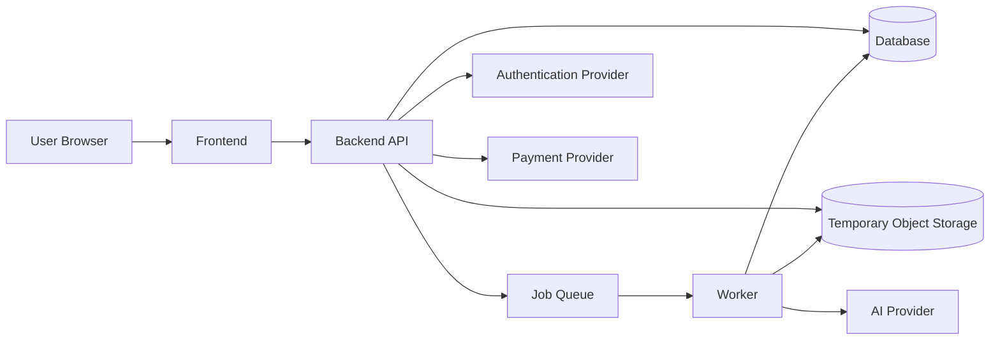
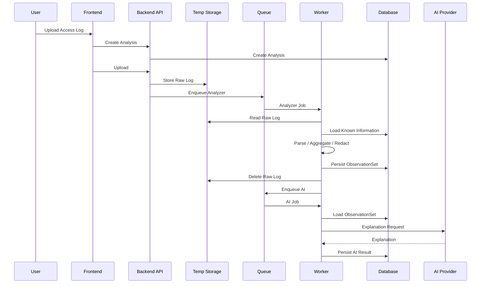

# Project Polaris
# 18_MVP_System_Architecture
## MVPシステムアーキテクチャ設計

# 1. 目的
00〜17で定義した論理設計を、実際にデプロイ可能なMVP構成へ落とし込む。

対象：

```text
Frontend
Backend API
Analyzer Worker
AI Worker
Job Queue
Database
Temporary Object Storage
Authentication Provider
Payment Provider
Deployment
Failure Boundary
Scaling
```

# 2. 基本方針
最初からMicroservices化しない。

```text
Frontend
Backend API
Worker
Database
Queue
Storage
```

程度の物理分離で開始し、Analyzer / AI等は論理境界として分離する。

Raw Log解析は長時間処理になり得るため、HTTP Request内で完結させずQueue経由のWorker処理とする。

# 3. System Overview



# 4. Frontend
責務：

```text
Authentication UI
Project管理
Access Log Upload
Analysis Status
Aggregation View
AI Explanation
AI Chat
Report / Export
Billing UI
```

Frontend自身では解析・Urgency判定を行わない。

Backend APIをApplication Data Boundaryとする。

# 5. Backend API
責務：

```text
Authentication確認
Authorization
Entitlement確認
Project CRUD
Analysis作成
Upload受付
Status取得
ObservationSet取得
AI Explanation取得
AI Chat受付
Billing連携
Delete
```

持たない責務：

```text
Raw Log Parse
大量Aggregation
AI Prompt Execution
長時間Job
```

# 6. Upload Flow

```text
Browser
↓
Backend API
↓
Temporary Storage
↓
Analysis = uploaded
↓
Analyzer Job enqueue
```

大容量化した場合はSigned URLによるDirect Uploadへ移行可能にする。

# 7. Temporary Object Storage
保存対象：

```text
Raw Access Log
Temporary Upload Data
```

保存しない：

```text
ObservationSet
AI Result
Application Metadata
```

Raw Logは15章のRetention Policyに従い削除する。

# 8. Database
永続保存：

```text
Accounts
Projects
Analyses
ObservationSets
AIExplanationResults
Known Information
Subscriptions
Usage
Execution Status
```

Raw Access Log本文は保存しない。

MVPではRelational Databaseを推奨する。

理由：

```text
Account
Project
Analysis
Subscription
Usage
Ownership
```

の関係、Transaction、Constraintが重要なため。

ObservationSetはMVPではJSON Column保存を推奨する。

# 9. Job Queue
Queue対象：

```text
Analyzer Job
AI Explanation Job
AI Retry
Raw Log Delete Retry
Cleanup Job
```

最低要件：

```text
enqueue
ack
retry
attempt count
lock / visibility
failed job tracking
```

Workflow Engineは初期必須ではない。

# 10. Analyzer Worker
責務：

```text
Raw Log取得
Parse
Normalize
Exclusion
Aggregation
Known Information Annotation
Candidate Selection
Redaction
Reference Resolution
ObservationSet生成
Persist
Raw Log Delete Trigger
AI Job Trigger
```

Input例：

```typescript
interface AnalyzerJobInput {
  analysisId: string;
  rawLogStorageKey: string;
}
```

成功時はObservationSet / Metadataを保存する。

PartialでもObservationSetが成立する場合は保存し、Parse Warningを保持する。

Fatal時はAIを起動しない。

# 11. AI Worker
責務：

```text
ObservationSet取得
AI Input生成
AI Provider呼び出し
Response Validation
Reference Validation
AIExplanationResult保存
```

Raw Log Storageへアクセスさせない。

AI Jobには原則、

```text
analysisId
purpose
```

のみを渡し、Worker自身がDBからObservationSetを取得する。

# 12. Worker構成
MVPではAnalyzer Worker / AI Workerを同一Deployにしてよい。

例：

```text
worker
├─ analyzer handler
├─ ai explanation handler
├─ cleanup handler
└─ delete handler
```

Code Moduleは分離する。

将来、AnalyzerはCPU/Memory寄り、AIはExternal API待ち寄りという負荷差が出たら別Deployへ分離する。

# 13. Authentication Provider
Provider側：

```text
Sign Up
Login
Email Verification
Password Reset
Session / Token
```

Polaris Backend側：

```text
Authenticated Identity
Project Ownership
Application Authorization
```

を担当する。

# 14. Payment Provider
Provider側：

```text
Checkout
Card Handling
Subscription Payment
Invoice / Receipt
Customer Portal
Webhook
```

PolarisはCard情報を保持しない。

# 15. AI Provider
送信するのはObservationSetから生成したAIExplanationInputのみ。

送信しない：

```text
Raw Log
Raw File
Storage Key
Original Sensitive Query Value
```

# 16. Public / Private Boundary
Public：

```text
Frontend
Backend API
Auth Callback
Payment Webhook Endpoint
```

Private：

```text
Database
Job Queue
Worker
Temporary Storage
Internal Job Endpoint
```

可能な限りWorker / DB / QueueをPublic Internetへ直接公開しない。

# 17. Environment
最低限：

```text
local
production
```

可能なら：

```text
development
staging
production
```

Production DataをDevelopmentへコピーしない。

Secret / DB / Queue / Storage / Payment / AI設定はEnvironmentごとに分離する。

# 18. Success Flow



# 19. Failure Boundary

```text
Frontend Failure
→ Backend Dataは維持

API Failure
→ Worker Jobは継続可能

Analyzer Fatal
→ AIは実行しない

AI Failure
→ Analyzer Resultは利用可能

ObservationSet Persist Failure
→ Raw Logを削除せずRetry

Raw Log Delete Failure
→ Resultは有効、Cleanup Retry

Payment Failure
→ Dataは削除しない

Authentication Failure
→ Data Processing Failureとは分離
```

# 20. Queue Failure
Job enqueueに失敗した場合、

```text
Analysis = uploaded
Analyzer not started
```

としてRecovery可能にする。

enqueue失敗なのに`analyzing`へ進めない。

# 21. Duplicate Job Protection
同一AnalysisでAnalyzer / AI Jobを二重実行しない。

```text
Analysis Status
Execution Record
Job Lock
```

等でGuardする。

Worker Handlerは可能な限りIdempotentにする。

# 22. File Processing
Raw Logを全件Memoryへ読み込まない。

```text
Stream Read
Line Parse
Incremental Aggregation
```

を基本とする。

Memory消費をFile Sizeに比例させない設計を目指す。

# 23. Resource Limit
Workerには、

```text
Memory Limit
CPU Limit
Execution Timeout
File Size Limit
Line Guard
Concurrency Limit
```

を持つ。

大量AnalysisはQueueでBackpressureする。

# 24. Retry
例：

```text
Infrastructure transient error
→ Retry

Invalid Log
→ Retryしない

AI Rate Limit
→ Backoff Retry

Raw Log Delete Failure
→ Cleanup Retry
```

Error CodeごとにRetryabilityを持つ。

# 25. Observability
API：

```text
Request Count
Error Rate
Latency
```

Analyzer：

```text
Queue Wait
Execution Time
Parsed Lines
Failed Lines
Memory
Failure Rate
```

AI：

```text
Latency
Provider Error
Token Usage
Schema Failure
```

Storage：

```text
Upload Failure
Delete Failure
Expired Object
```

Raw Log / Raw Query / Token / ObservationSet全文 / Prompt全文はMonitoring Logへ出さない。

# 26. Health Check

```text
API Health
Database Connectivity
Queue Connectivity
Worker Heartbeat
```

AI Provider FailureをApplication全体Downとは扱わない。

# 27. Deployment Unit
MVP推奨：

```text
Frontend
Backend API
Worker
Database
Queue
Object Storage
```

FrontendとAPIは同一Platformでもよい。

Workerだけ別Processとして実行できることが重要。

# 28. Monorepo
相性がよい例：

```text
apps/
  web/
  api/
  worker/

packages/
  analyzer/
  ai/
  domain/
  shared/
```

Analyzer / AI / Domain型を共有しやすい。

# 29. Domain Boundary
Domain Model：

```text
Analysis
ObservationSet
AIExplanationResult
Known Information
Entitlement
```

をFrontend専用型やORM型へ直接依存させない。

Analyzer Packageは、

```text
Raw Log Stream
Config
Known Information
↓
ObservationSet
```

を生成できる独立構造とする。

AI Packageは、

```text
ObservationSet
Purpose
↓
AIExplanationResult
```

の境界を持つ。

# 30. Vendor Abstraction
過剰な抽象化は不要だが、次はInterface境界を持つ価値がある。

```text
Object Storage
AI Provider
Payment Provider
Auth Identity
```

Vendor SDKをDomain Layer全体へ拡散させない。

# 31. Scaling
初期：

```text
1 API
1 Worker
Managed DB
Managed Queue
Managed Storage
```

でも開始可能。

負荷増加時：

```text
API Scale Out
Worker Scale Out
Analyzer / AI Worker分離
DB Upgrade
```

へ進める。

Analysis単位で独立しているためHorizontal Scalingしやすい。

1 Analysis自体を複数Workerへ分散する設計はMVPでは行わない。

# 32. Object Storage Lifecycle
Application Deleteに加えStorage Lifecycle RuleもSafety Netとして利用可能。

例：

```text
raw-logs/
→ 24hでExpire
```

# 33. Backup
DB Persistent DataのみBackup対象とする。

Raw Log StorageはBackupしない。

QueueをBusiness DataのSource of Truthにしない。

# 34. Source of Truth

```text
Account / Project / Analysis Metadata
→ Database

Analyzer Result
→ ObservationSet in Database

AI Result
→ AIExplanationResult in Database

Raw Log
→ Temporary Storage only

Payment State
→ Payment Provider + synchronized DB state
```

# 35. MVPで採用しないもの

```text
Kubernetes前提
多数Microservices
Event Sourcing
CQRS
Distributed Aggregation
Kafka前提
Workflow Engine必須
Graph Database
Raw Log Data Lake
Permanent Log Storage
```

必要になってから導入する。

# 36. Hosting選定条件

```text
Long-running Worker
Memory Limit
CPU
Job Queue
PostgreSQL
Object Storage
Private Networking
Secret Management
Deployment Cost
Region
Backup
Observability
```

具体Providerは本章では固定しない。

# 37. MVP Recommended Physical Architecture

```text
[Browser]
   ↓
[Frontend]
   ↓
[Backend API]
   ├─ [PostgreSQL]
   ├─ [Temporary Object Storage]
   ├─ [Job Queue]
   ├─ [Auth Provider]
   └─ [Payment Provider]

[Worker]
   ├─ Analyzer Handler
   ├─ AI Handler
   └─ Cleanup Handler
        ↓
      [AI Provider]
```

# 38. MVP確定事項

1. 最初からMicroservices化しない。
2. Frontend / API / Worker / DB / Queue / Storageを主要構成とする。
3. 長時間Analyzer処理をHTTP Request内で完了させない。
4. AnalyzerをQueue経由でWorker実行する。
5. AIも非同期Worker処理を基本とする。
6. Analyzer / AI Workerは論理分離する。
7. MVPでは同一Worker Deployでもよい。
8. Raw LogはTemporary Object Storageへ保存する。
9. Raw Log本文をDBへ保存しない。
10. ObservationSetはMVPではDB JSON保存を推奨する。
11. Relational Databaseを推奨する。
12. AI WorkerはRaw Log Storageへ依存しない。
13. ObservationSet保存後にRaw Log削除を行う。
14. QueueをSource of Truthにしない。
15. Worker HandlerはIdempotentを意識する。
16. Duplicate Analyzer / AI Jobを防ぐ。
17. Raw LogはStreaming処理を基本とする。
18. WorkerにResource / Concurrency Limitを持たせる。
19. API / Analyzer / AI / Storage / Payment Failureを分離する。
20. Auth / Paymentは外部Managed Service利用を推奨する。
21. Vendor SDKをDomain Layer全体へ拡散させない。
22. 初期は1 API + 1 Workerでも開始可能。
23. Analysis単位でHorizontal Scaling可能とする。
24. Kubernetes / Kafka等をMVP前提にしない。
25. Storage Lifecycle RuleをRaw Log削除Safety Netとして利用可能にする。

# 39. 次の設計対象

次は、

```text
19_Technology_Stack_and_Deployment
```

を設計する。

対象：

```text
Frontend Framework
Backend Runtime
Database
Queue
Object Storage
Authentication
Payment
AI SDK
Hosting / Deployment
Local Development
CI/CD
```

18では抽象的な実装構成を固定した。
19では具体的なTechnology候補を比較し、Polaris MVPとして採用する構成を決める。
