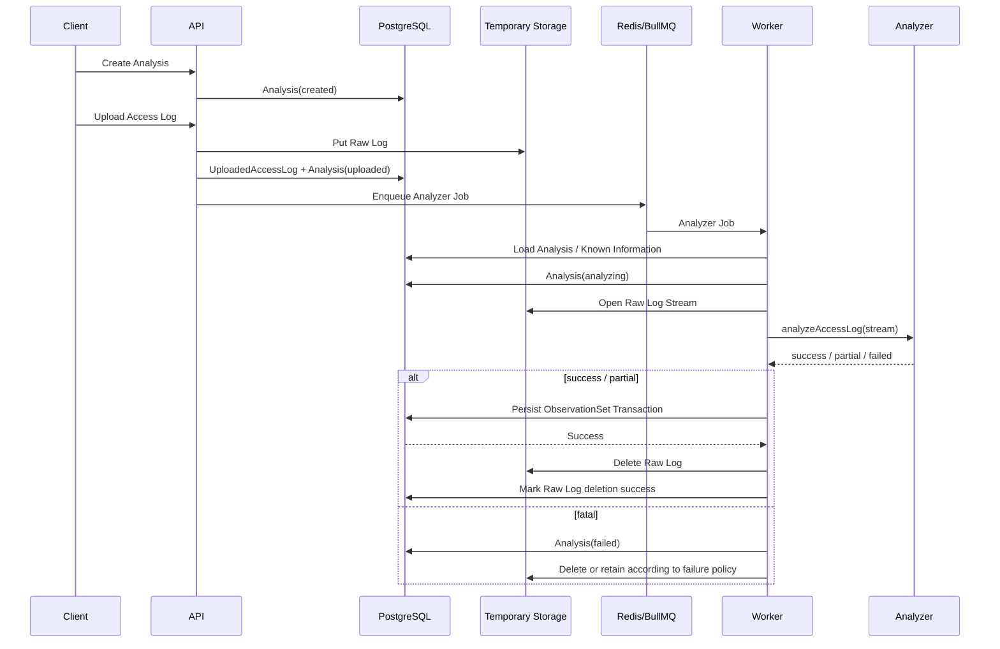

# Project Polaris
# 34_Development_Setup_and_Fourth_Sprint
## Sprint 4 実装指示・受入基準

---

# 1. Sprint 4の目的

Sprint 3までで、

```text
Access Log
↓
Analyzer
↓
ObservationSet
↓
PostgreSQL Persist
```

が成立した。

Sprint 4では、これを実際のProduct Lifecycleへ接続する。

中心Flow：

```text
Analysis Create
↓
Raw Access Log Upload
↓
Temporary Object Storage
↓
Analyzer Job enqueue
↓
Worker
↓
Raw Log Stream
↓
Analyzer
↓
ObservationSet Persist
↓
Raw Log Delete
↓
Analysis Result Ready
```

Sprint 4の目的は、

> **HTTP RequestからAnalyzerを切り離し、Queue / Worker / Temporary Storageを介した安全な非同期解析Lifecycleを成立させること**

である。

---

# 2. Sprint 4の位置付け

MVP Implementation Plan上では、

```text
Phase 4 Queue / Worker
+
Phase 5 Upload Lifecycle
```

を対象とする。

通常は別Phaseだが、Polarisでは両者が強く依存する。

```text
Upload
↓
Temporary Storage
↓
Queue
↓
Worker
↓
Analyzer
```

まで繋がらないとEnd-to-Endとして検証できないため、
Sprint 4では一つの実装単位として扱う。

---

# 3. Sprint 4 Scope

対象：

```text
Redis / BullMQ
Queue Package / Queue Boundary
Worker Runtime
Analyzer Job Handler
Temporary Object Storage Boundary
MinIO Local Adapter
UploadedAccessLog Persistence
Upload Lifecycle
Analyzer Job Enqueue
Raw Log Stream Read
ObservationSet Persist Integration
Raw Log Delete
Delete Retry
Cleanup Job
Job Idempotency
Retry Classification
Worker Crash / Retry Safety
API最小Upload Endpoint
Analysis Status Retrieval
Integration / E2E Test
CI Redis / Object Storage
```

---

# 4. Sprint 4で実装しないもの

以下はScope外。

```text
Vue Aggregation UI
AI Explanation
AI Job
OpenAI
AI Chat
Authentication / Clerk
Ownership
Billing / Stripe
Entitlement
Report Export
CSV Export
WebSocket / SSE
Real-time Monitoring
Compressed Log Upload
Direct Signed URL Upload
Production Railway Deployment
```

APIはSprint 4 E2E成立に必要な最小範囲のみ。

---

# 5. 最重要Safety Invariant

Sprint 4の最重要条件：

```text
ObservationSet Persist成功前に
Raw Access Logを削除してはならない
```

必ず、

```text
Analyzer success / partial
↓
Valid ObservationSet
↓
DB Transaction Persist SUCCESS
↓
Raw Log Delete
```

の順序とする。

禁止：

```text
AnalyzerがObservationSetを生成
↓
Raw Log Delete
↓
DB Persist
```

DB Persistが失敗した場合にRaw Logを失い、
Retry不能になるため。

---

# 6. Source of Truth

Sprint 4でも以下を維持する。

```text
Analysis Metadata
→ PostgreSQL

ObservationSet
→ PostgreSQL

Raw Access Log
→ Temporary Object Storage

Job State
→ Redis / BullMQ

Queue
≠ Business Data Source of Truth
```

Redisが消失しても、
DB / Storage StateからRecovery可能な設計を優先する。

---

# 7. Physical Flow



Fatal時のRaw Log削除Policyは後述する。

---

# 8. Existing Repository Reality

既にRepositoryには、

```text
apps/api
apps/worker
packages/db
packages/analyzer
packages/domain
packages/shared
infra/docker
```

が存在する。

Local Infrastructure：

```text
PostgreSQL
Redis
MinIO
```

もDocker Composeに存在する。

Sprint 4では既存Scaffoldを使い、
新しいApplication Packageを増やさない。

---

# 9. Redis Local Port

現在Local Redis Host Port：

```text
56379
```

で権限エラーが発生した実績がある。

Sprint 4ではRedisが実Dependencyになるため、
最初に解消する。

方針：

```text
56379で正常起動可能
```

なら維持。

不可なら、

```text
56380
56381
等の未使用Port
```

へ変更してよい。

重要なのはPort番号そのものではなく、

```text
docker compose up
↓
redis-cli PING
↓
PONG
```

が成立すること。

README / `.env.example` / Test Configを同時更新する。

---

# 10. Queue Technology

Sprint 4では、

```text
Redis
BullMQ
```

を採用する。

最初からWorkflow Engineを導入しない。

QueueはMVPでは分離しすぎない。

推奨：

```text
analyzer
maintenance
```

AI QueueはAI Sprintで追加する。

---

# 11. Queue Boundary

BullMQ SDKをApplication全体へ直接拡散させない。

推奨：

```text
packages/queue
```

を新設するか、
`packages/shared`配下にQueue Adapterを置くことも可能。

ただし責務が明確なので推奨は、

```text
packages/queue
```

とする。

責務：

```text
Queue Name
Job Type
Job Payload Schema
enqueue
Queue Connection
Default Retry / Backoff
```

Worker Handler Logicは置かない。

---

# 12. Queue Domain

最低Job：

```typescript
interface AnalyzerJobData {
  analysisId: string;
}

interface RawLogDeleteJobData {
  analysisId: string;
}

interface CleanupExpiredRawLogsJobData {
  scheduledAt: string;
}
```

重要：

```text
rawLogStorageKeyをJob Payloadへ必須で持たせない
```

ことを推奨する。

理由：

```text
Queue
≠ Source of Truth
```

だから。

Workerは、

```text
analysisId
↓
DB
↓
UploadedAccessLog
↓
storageKey
```

を取得する。

これによりStorage Key変更やRetry時もDBを正本とできる。

旧設計の、

```typescript
{
  analysisId,
  rawLogStorageKey
}
```

はMVP初期案としては成立するが、
Sprint 4ではDB正本方針を優先する。

---

# 13. UploadedAccessLog Persistence

Sprint 3では未実装だったため追加する。

概念：

```typescript
interface UploadedAccessLog {
  id: string;
  analysisId: string;
  originalFileName: string;
  sizeBytes: number;
  mimeType?: string;
  storageKey: string;
  status:
    | 'uploaded'
    | 'processing'
    | 'deleted'
    | 'expired';
  deletionStatus:
    | 'pending'
    | 'success'
    | 'failed';
  createdAt: string;
  expiresAt: string;
  deletedAt?: string;
}
```

---

# 14. UploadedAccessLog Relation

MVP：

```text
1 Analysis
=
最大1 Raw Access Log
```

をDB Constraintで保証する。

推奨：

```prisma
analysisId String @unique
```

Uploadやり直しを同一Analysisへ許可するかは複雑になるため、
MVPでは、

```text
Upload失敗
→ Retry可能

Upload完了後に別Fileへ差し替え
→ 原則不可
```

とする。

再解析：

```text
New Analysis
```

---

# 15. Storage Key

必須：

```text
raw-logs/{analysisId}/{randomId}
```

Original File Name：

```text
Storage Keyへ使わない
```

禁止：

```text
raw-logs/client-production-access.log
```

案件名 / Domain / File Name等をObject Keyから推測できない構造にする。

---

# 16. Temporary Object Storage Boundary

Vendor SDKをAPI / Workerへ直接散らさない。

Interface：

```typescript
interface TemporaryObjectStorage {
  putObject(params: {
    key: string;
    body: NodeJS.ReadableStream;
    contentType?: string;
  }): Promise<void>;

  getObjectStream(key: string): Promise<NodeJS.ReadableStream>;

  deleteObject(key: string): Promise<void>;

  exists(key: string): Promise<boolean>;
}
```

必要以上のGeneric Storage Frameworkを作らない。

---

# 17. MinIO Local Adapter

Local Development / Integration Testでは既存MinIOを利用する。

S3 Compatible SDKを使用する。

Local：

```text
MinIO
```

Production：

```text
Railway Storage Bucket等のS3 Compatible Storage
```

へ差し替え可能にする。

Sprint 4ではRailway実接続は不要。

---

# 18. Storage Bucket / Prefix

Local Test用Bucket例：

```text
polaris-raw-logs
```

Object Key：

```text
raw-logs/{analysisId}/{randomId}
```

Bucketが存在しない場合、
Local Setup Script / Test Setupで作成する。

Application Runtimeが毎Request Bucket Createを試みる設計にはしない。

---

# 19. Upload Validation

最低：

```text
File exists
Non empty
Size Limit
Analysis exists
Analysis.status = created
No existing UploadedAccessLog
```

認証 / OwnershipはSprint 4ではScope外。

ただし将来Ownership Checkを追加可能なApplication Boundaryにする。

---

# 20. MIME / Extension

Extension / MIMEだけでAccess Log判定をしない。

Upload時：

```text
binary executable等として実行しない
```

Parserが実Contentを判定する。

MVPでは、

```text
plain text Access Log
```

のみ受け付ける。

gzip等Compressed Logは対応しない。

---

# 21. Upload Size Limit

Unlimitedは禁止。

具体値は最終Benchmark前なのでConfig化する。

例：

```text
MAX_UPLOAD_BYTES
```

Default値はImplementation Plan段階で仮置きしてよい。

重要：

```text
API
Storage
Worker
```

の各Boundaryで無制限化しない。

---

# 22. Upload Atomicity

UploadはDB TransactionとObject Storageを完全Atomicにはできない。

したがってFailure Caseを明示する。

正常：

```text
Object Storage Put
↓
UploadedAccessLog DB Persist
↓
Analysis.status = uploaded
↓
Analyzer Job enqueue
```

---

# 23. Storage Put失敗

```text
Storage Put Failure
↓
Analysis.status = created
UploadedAccessLogなし
Jobなし
```

Retry Upload可能。

---

# 24. DB Persist失敗 after Storage Put

```text
Storage Put Success
↓
DB Persist Failure
```

この場合ObjectがOrphanになる可能性がある。

対応：

```text
Best-effort immediate delete
+
Cleanup Safety Net
```

DB Persist失敗時にObjectを放置しない努力をする。

ただしDeleteまで失敗しても、
Raw Log内容をError Logへ出さない。

---

# 25. Enqueue失敗 after Upload Persist

```text
Storage Put Success
↓
DB Persist Success
↓
Analysis.status = uploaded
↓
Queue enqueue Failure
```

この場合：

```text
Analysis.status = uploaded
UploadedAccessLog = uploaded
```

を維持する。

禁止：

```text
Analysis.status = analyzing
```

Recovery可能状態として残す。

---

# 26. Enqueue Recovery

Queue enqueue Failureを無期限放置しない。

Sprint 4では最低どちらかを実装する。

推奨：

```text
enqueueAnalyzerJob(analysisId)
```

をIdempotentにし、
API Internal RetryまたはRecovery Functionから再実行可能にする。

将来Scheduled Recoveryを追加可能。

MVPでは、

```text
uploaded Analysis
+
no active analyzer job
```

を検出して再enqueueできる内部Function / Testを持つ。

Public Retry APIは必須ではない。

---

# 27. Job ID

BullMQ Analyzer Jobでは、

```text
jobId = analyzer:{analysisId}
```

等のDeterministic Job IDを利用する。

目的：

```text
同一Analysisの二重enqueue防止
```

ただしBullMQ Job IDだけを唯一のIdempotency保証にしない。

Worker側でもDB Stateを確認する。

---

# 28. Worker Start Guard

Analyzer Worker受信時：

```text
Analysis取得
UploadedAccessLog取得
ObservationSet存在確認
```

以下ならNo-op / Completed扱い：

```text
ObservationSet already exists
Analysis.status = analyzer_result_ready
Analysis.status = completed
```

以下は実行不可：

```text
Analysis.status = created
Analysis.status = failed
```

想定：

```text
Analysis.status = uploaded
または
retry中の analyzing
```

---

# 29. Status Transition at Worker Start

最初の通常実行：

```text
uploaded
↓
analyzing
```

Analyzer Status：

```text
running
```

UploadedAccessLog：

```text
processing
```

Queueへ入った時点で`analyzing`にはしない。

Workerが実Jobを開始した時点で変更する。

---

# 30. Worker Retry and `analyzing`

Infrastructure Failure後のBullMQ Retryでは、
Analysisが既に、

```text
analyzing
```

の可能性がある。

現在の`assertValidAnalysisStatusTransition()`は同Status更新を許可するため、

```text
analyzing → analyzing
```

をIdempotentに扱える。

ただしAnalyzer Resultが既に存在するなら再実行しない。

---

# 31. Raw Log Stream

Worker：

```text
Storage.getObjectStream()
↓
AsyncIterable<string | Buffer>
↓
parseAccessLogStream()
```

へ繋ぐ。

禁止：

```text
getObject()
↓
Buffer全件
↓
split
```

Access Log全件をMemoryへ保持しない。

---

# 32. Known Information Load

WorkerはAnalyzer実行前に、

```text
Project Known Information
+
Built-in Known Information
```

をLoadする。

Disabled Project Known Informationは、
Sprint 3のMapperを使って除外する。

User Known Informationは未実装。

---

# 33. Analyzer Result Handling

```text
success
partial
failed
```

を分ける。

Success / Partial：

```text
persistAnalyzerSuccess()
```

を利用する。

Failed：

```text
persistAnalyzerFailure()
```

を利用する。

Sprint 3で確立したPersistence Contractを再実装しない。

---

# 34. ObservationSet Persist Failure

`persistAnalyzerSuccess()`が失敗した場合：

```text
Raw Logを削除しない
```

Worker JobをFailureにして、
Retry Classificationへ渡す。

DB Temporary Failure：

```text
Retry
```

Invalid ObservationSet：

```text
Retryしても直らない
```

ためNon-retryable。

---

# 35. Raw Log Delete

ObservationSet Persist成功後：

```text
deleteObject(storageKey)
```

を実行する。

Delete成功：

```text
UploadedAccessLog.status = deleted
deletionStatus = success
deletedAt = now
```

---

# 36. Raw Log Delete Failure

ObservationSet Persist後のDelete Failureは、

```text
Analyzer Resultを失敗に戻さない
```

ObservationSetは有効。

状態：

```text
Analysis.status = analyzer_result_ready
UploadedAccessLog.deletionStatus = failed
```

Delete Retry Jobをenqueueする。

---

# 37. Delete Retry Job

Job：

```typescript
{
  analysisId: string
}
```

WorkerはDBからstorageKeyを取得。

DeleteはIdempotentにする。

Objectが既に存在しない場合も、

```text
Deletion Success
```

として扱えることを推奨する。

---

# 38. Cleanup Job

最大Retention超過Raw Logを削除するSafety Net。

条件：

```text
expiresAt < now
AND
status != deleted
```

Cleanup：

```text
DB対象検索
↓
Storage delete
↓
Deletion Status update
```

---

# 39. CleanupとPersist中Raw Log

重要：

Cleanupが、

```text
ObservationSet Persist Retry中
```

のRaw Logを早期削除しないこと。

Retention上限到達時には最終的に削除するが、
通常Retry中は保持する。

MVP初期候補：

```text
expiresAt = Upload + 24h
```

---

# 40. Fatal Analyzer時のRaw Log

AnalyzerがNon-retryable Fatal：

```text
PARSER_NO_VALID_LINES
ANALYZER_INVALID_CONFIGURATION
ANALYZER_REDACTION_SAFETY_FAILURE
ANALYZER_OBSERVATION_SET_INVALID
```

等で終了した場合、
同一AnalysisのAnalyzer再実行価値は原則ない。

MVP推奨：

```text
Analysis failed Persist
↓
Raw Log delete
```

ただしAnalysis failedのDB Persist成功を確認してから削除する。

Delete FailureはMaintenance Retry対象。

---

# 41. Infrastructure Failure時Raw Log

例：

```text
Storage temporary read error
DB connection error
Redis transient error
Worker crash
```

Raw Logを削除しない。

Retry可能性を維持する。

---

# 42. Retry Classification

Retryable例：

```text
Redis transient
Storage read transient
Storage network timeout
DB connection transient
Prisma infrastructure error
Worker unexpected infrastructure interruption
```

Non-retryable例：

```text
PARSER_NO_VALID_LINES
ANALYZER_INVALID_CONFIGURATION
ANALYZER_REDACTION_SAFETY_FAILURE
ANALYZER_OBSERVATION_SET_INVALID
Unsupported / unusable input
```

Error Message文字列判定ではなく、
Error Code / Error Classで分類する。

---

# 43. BullMQ Retry

Analyzer Job：

```text
attempts
backoff
```

を設定。

例：

```text
attempts = 3
exponential backoff
```

具体値はPlan Review時に調整可能。

重要：

```text
Non-retryable Failure
```

ではBullMQ Retryを無駄に消費しないこと。

---

# 44. Worker Crash Points

最低限以下をTestする。

## Crash A

```text
Worker Start
↓
Analysis = analyzing
↓
Crash before Analyzer
```

Retryで再開可能。

## Crash B

```text
Analyzer completed
↓
Crash before Persist
```

Raw Log残存。
Retry可能。

## Crash C

```text
ObservationSet Persist Success
↓
Crash before Raw Log Delete
```

Retry時：

```text
ObservationSet存在
↓
Analyzer再実行しない
↓
Raw Log Deleteだけ完了
```

が最重要。

---

# 45. Idempotency Critical Case

特にCritical：

```text
ObservationSet Persist SUCCESS
↓
Worker crash
↓
BullMQ retry
↓
Analyzer再実行
↓
2nd ObservationSet INSERT
```

を防ぐ。

Worker Retry時に、

```text
ObservationSetRepository.findByAnalysisId()
```

を最初に確認。

存在する場合：

```text
Analyzer skip
↓
Raw Log deletion state確認
↓
必要ならDelete
↓
Job success
```

---

# 46. Duplicate Worker Race

BullMQ Job IDに加えて、
DB Unique Constraint：

```text
ObservationSet.analysisId UNIQUE
```

が最終防御。

同時Workerが万一走っても、
二重ObservationSet PersistはDBで拒否される。

ただし通常FlowでUnique Conflictを頻発させない。

---

# 47. Analysis Status CAS

Sprint 4ではWorker多重実行対策として、
単純：

```text
findById
↓
update
```

だけではRaceが残る。

最低限、Worker Start時の、

```text
uploaded → analyzing
```

はCompare-And-Set相当を検討する。

例：

```text
UPDATE Analysis
SET status = ANALYZING
WHERE id = ?
AND status = UPLOADED
```

Affected Rows = 1 のWorkerのみ実行。

Sprint 4 Plan Reviewではこの実装方式を必ず確認する。

---

# 48. Why CAS Matters

2 Workerが同時に、

```text
Analysis.status = uploaded
```

をReadすると、
両方が`analyzing`へ進める可能性がある。

BullMQ Job IDだけで十分と仮定しない。

DB State TransitionをConcurrency Guardにも使う。

---

# 49. UploadedAccessLog Status Update

同様に、

```text
uploaded
↓
processing
↓
deleted
```

を持つ。

ただしAnalysis StatusとRaw Log Statusを1つの巨大Transactionへ詰め込みすぎない。

Object StorageはDB Transactionへ参加できないため、
Compensation / Retry前提で設計する。

---

# 50. Minimal API

Sprint 4ではE2Eに必要なAPIだけ実装する。

```text
POST /projects/{projectId}/analyses
POST /analyses/{analysisId}/upload
GET  /analyses/{analysisId}
GET  /analyses/{analysisId}/observations
```

Project Create APIはTest Fixture / Seedで代替してもよいが、
既存API Scaffoldを実装する場合は最小CRUDでよい。

---

# 51. API Framework

既存Technology Stackに従い、

```text
Fastify
TypeScript
```

を使用。

Analyzer LogicをAPI Processで実行しない。

API：

```text
Upload
Persist
Enqueue
Return
```

まで。

---

# 52. Upload Response

Upload成功後：

```json
{
  "analysisId": "...",
  "status": "uploaded"
}
```

Analyzer完了をHTTP Responseで待たない。

---

# 53. Polling

MVP：

```text
GET /analyses/{id}
```

でStatus Polling。

WebSocket / SSEはSprint 4では不要。

---

# 54. API Error vs Analysis Failure

明確に分ける。

```text
Upload Request Failure
→ HTTP Error

Analyzer Job Fatal
→ HTTP upload success済み
→ Analysis.status = failed
```

Analyzer失敗をUpload RequestのHTTP Responseへ後から反映しない。

---

# 55. Upload Retry

Storage Put前Failure：

```text
同一AnalysisでRetry可能
```

Storage Put済み / DB未PersistのOrphan Case：

```text
Compensating Delete
```

UploadがDB上`uploaded`まで完了した後は、
同一Analysisへの再Uploadは拒否。

---

# 56. Environment Variables

最低：

```text
DATABASE_URL
REDIS_URL

OBJECT_STORAGE_ENDPOINT
OBJECT_STORAGE_REGION
OBJECT_STORAGE_BUCKET
OBJECT_STORAGE_ACCESS_KEY
OBJECT_STORAGE_SECRET_KEY
OBJECT_STORAGE_FORCE_PATH_STYLE

MAX_UPLOAD_BYTES
RAW_LOG_RETENTION_HOURS
```

Environment Validationを`packages/shared`へ追加。

SecretをSourceへ書かない。

---

# 57. Local `.env.example`

Local Dockerに合わせた例を用意する。

ただしReal SecretをCommitしない。

MinIO Default Local CredentialはDevelopment用Exampleとしてのみ扱う。

---

# 58. CI Infrastructure

Sprint 4 CI：

```text
PostgreSQL
Redis
MinIO
```

を起動する。

CI Test：

```text
Migration
Redis Connection
Bucket Setup
Queue / Worker
Upload
Analyzer
ObservationSet Persist
Raw Log Delete
```

まで成立させる。

---

# 59. E2E Test — Success

```text
Create Project
↓
Create Analysis
↓
Upload Synthetic Access Log
↓
Storage Object exists
↓
Analysis uploaded
↓
Analyzer Job enqueue
↓
Worker processing
↓
ObservationSet persisted
↓
Analysis analyzer_result_ready
↓
Raw Log object deleted
↓
UploadedAccessLog deletion success
```

---

# 60. E2E Test — Partial

Partial Parse Fixture：

```text
Upload
↓
Analyzer partial
↓
ObservationSet persist
↓
Analysis analyzer_result_ready
AnalyzerStatus partial
↓
Raw Log delete
```

---

# 61. E2E Test — Fatal

Invalid Log Fixture：

```text
Upload
↓
Analyzer failed
↓
Analysis failed
↓
ObservationSet none
↓
Raw Log delete after failure persist
```

---

# 62. E2E Test — Persist Failure

Fault Injection等で、

```text
Analyzer success
↓
ObservationSet Persist failure
↓
Raw Log still exists
↓
Job retryable
```

を確認する。

これがSprint 4の最重要Failure Testの1つ。

---

# 63. E2E Test — Delete Failure

```text
ObservationSet persisted
↓
Delete failure
↓
Analysis remains analyzer_result_ready
↓
DeletionStatus failed
↓
Maintenance Job
↓
Delete success
```

---

# 64. E2E Test — Crash after Persist

```text
ObservationSet persisted
↓
simulate crash
↓
Retry job
↓
ObservationSet detected
↓
Analyzer NOT rerun
↓
Raw Log deleted
```

必須。

---

# 65. E2E Test — Duplicate Enqueue

同一Analysisへ2回enqueue：

```text
Analyzer execution = one effective execution
ObservationSet = one
```

を確認。

BullMQ Job ID + DB State Guardの双方をTestする。

---

# 66. Queue / Worker Test Isolation

Redis Test DataがTest間で混ざらないよう、

```text
Queue Prefix
Queue Name suffix
flushdb
```

等を利用する。

Production Redis DBをTestから使わない。

---

# 67. MinIO Test Isolation

Object KeyにTest Run IDを使う。

```text
test/{runId}/raw-logs/...
```

Test終了時にCleanup。

共有Bucket内の別Test Objectを削除しない。

---

# 68. Sensitive Logging

Application / Worker Logへ出さない。

```text
Raw Log Line
Raw File Body
Raw Query
Token
Email
ObservationSet全文
Storage Secret
StorageKey + OriginalFileNameを組み合わせた機密情報
```

Log候補：

```text
analysisId
jobId
stage
duration
errorCode
attempt
bytes
```

---

# 69. Worker Shutdown

SIGTERM / SIGINTで、

```text
new Job受付停止
↓
現在Job終了待ち
↓
Redis connection close
↓
DB connection close
```

を行う。

Railway等でDeploy入替時にJobを途中で切りにくくする。

---

# 70. Concurrency

MVP初期：

```text
Analyzer Worker concurrency = 1
```

でもよい。

まず正しさ優先。

Benchmark後に増やす。

Queue Backpressureを利用する。

---

# 71. Timeout

Analyzer JobにはTimeout / Stalled Job復旧方針を持つ。

ただし独自TimerとBullMQ Lockを複雑に組み合わせない。

BullMQ標準Mechanismを優先。

---

# 72. Queue Failed Job

Failed JobはBullMQ側に履歴を残せる。

ただしBusiness StatusはDB。

```text
BullMQ failed
≠ Analysis status自動推論
```

Workerが適切なFailure Persistを行う。

Infrastructure Retry exhaustion時のDB Failure Status更新は設計する。

---

# 73. Retry Exhaustion

Infrastructure ErrorがRetry上限まで失敗した場合：

```text
Analysis.status = failed
AnalyzerStatus = failed
```

とするか、
別Infrastructure Failure状態を追加するかは慎重に判断。

MVPではStatus enum追加を避け、

```text
failed
+
internal errorCode
```

を推奨。

Raw Logは即削除ではなくRetention / Cleanupへ委ねる余地を持たせる。

理由：

```text
Operator Recovery
```

の可能性があるため。

---

# 74. Execution Record

Sprint 4で`AnalysisExecution` Tableを導入するかは実装Planで決める。

推奨：

```text
導入する
```

理由：

```text
attempt
errorCode
startedAt
completedAt
```

をAnalysis本体へ詰め込まず追跡できる。

ただしQueue Job Historyの完全複製はしない。

最低：

```text
analysisId
type = analyzer
status
attempt
errorCode?
startedAt?
completedAt?
```

---

# 75. AnalysisExecutionとBullMQ

役割分離：

```text
BullMQ
= Queue Execution Mechanism

AnalysisExecution
= Product-side Execution Metadata
```

Redisを失っても過去Execution情報を最低限DBに残せる。

---

# 76. AnalysisExecution Status

```text
queued
running
success
partial
failed
```

Analyzerの結果と似るが、
Execution単位の状態。

Retryごとに新Recordを作るかAttempt更新にするかは、
MVPでは単一Execution Record + attempt更新でもよい。

過剰なJob Historyは作らない。

---

# 77. Error Code Persistence

Raw Error Messageは保存しない。

保存：

```text
errorCode
attempt
stage
```

必要ならSafe Message。

DB / Storage SDKのraw stack / metaをUser-visible dataにしない。

---

# 78. Sprint 3 Minor m-01

Sprint 3 Review Minor：

```text
yarn install --ignore-engines
```

はSprint 4 Blockerではない。

Sprint 4でも無理に解消しなくてよい。

ただしDependency追加後、

```text
Node 20.19
+
BullMQ
+
S3 SDK
```

で実際に問題がないことはCIで確認する。

Node Versionを上げる必要が発生した場合は勝手に変更せず報告する。

---

# 79. Sprint 4 Task List

```text
S4-01 Redis Local Environment Fix
S4-02 Queue Dependency / Package Setup
S4-03 Queue Connection
S4-04 Job Data Types
S4-05 Analyzer Queue Enqueue
S4-06 Deterministic Job ID

S4-07 UploadedAccessLog Domain / DB Model
S4-08 UploadedAccessLog Migration
S4-09 UploadedAccessLog Repository
S4-10 Raw Log Deletion Status

S4-11 Temporary Object Storage Interface
S4-12 S3 Compatible Adapter
S4-13 MinIO Local Setup
S4-14 Object Storage Integration Test

S4-15 Worker Runtime
S4-16 Analyzer Job Handler
S4-17 Worker Start Status Guard
S4-18 Worker CAS / Concurrency Guard
S4-19 Known Information Load
S4-20 Raw Log Streaming into Analyzer

S4-21 Success / Partial Persist Integration
S4-22 Fatal Persist Integration
S4-23 Raw Log Delete
S4-24 Raw Log Delete Retry
S4-25 Cleanup Expired Raw Logs

S4-26 Retry Classification
S4-27 BullMQ Retry / Backoff
S4-28 Idempotency Guard
S4-29 Crash-after-Persist Recovery
S4-30 AnalysisExecution

S4-31 Minimal Fastify API
S4-32 Analysis Create Endpoint
S4-33 Upload Endpoint
S4-34 Analysis Status Endpoint
S4-35 ObservationSet Endpoint

S4-36 Upload Failure Compensation
S4-37 Enqueue Failure Recovery
S4-38 Sensitive Logging Check
S4-39 Environment Validation
S4-40 README / Local Setup

S4-41 CI Redis / MinIO
S4-42 Queue Integration Test
S4-43 Worker Integration Test
S4-44 Upload E2E Success
S4-45 Partial E2E
S4-46 Fatal E2E
S4-47 Persist Failure E2E
S4-48 Delete Failure Retry E2E
S4-49 Duplicate / Crash Recovery E2E
S4-50 Clean Environment Verification
```

---

# 80. Definition of Done

Sprint 4完了時、

```text
HTTP Upload
↓
Temporary Storage
↓
Redis Queue
↓
Worker
↓
Streaming Analyzer
↓
ObservationSet Persist
↓
Raw Log Delete
↓
GET Result
```

が成立する。

---

# 81. Critical Acceptance Criteria

```text
ObservationSet Persist前のRaw Log Deleteなし
Duplicate JobでAnalyzer二重実行なし
Crash after PersistでAnalyzer再実行なし
Failed AnalyzerでObservationSetなし
PartialはResult Ready
Persist Failure時Raw Log残存
Delete FailureでObservationSetを無効化しない
Raw LogはBuffer全件読込しない
QueueはSource of Truthではない
Storage KeyにOriginal File Nameなし
Sensitive Raw Data Loggingなし
```

---

# 82. Standard Acceptance Criteria

```text
Redis Queue          PASS
Worker               PASS
MinIO Storage        PASS
Upload API           PASS
Status Polling       PASS
ObservationSet API   PASS
Delete Retry         PASS
Cleanup              PASS
Retry Classification PASS
Environment          PASS
CI                    PASS
```

---

# 83. Clean Environment Verification

最低：

```text
docker compose down -v
docker compose up -d
```

確認：

```text
Postgres Ready
Redis PONG
MinIO Health OK
```

その後：

```text
yarn install
yarn db:migrate:deploy
yarn typecheck
yarn lint
yarn test
yarn build
```

さらにE2E：

```text
Upload fixture
↓
Queue
↓
Worker
↓
ObservationSet
↓
Raw Log delete
```

を確認する。

---

# 84. Claude Code 実装プロンプト

以下をClaude Codeへ渡す。

```text
Project Polaris Sprint 4を実装してください。

最初に以下の設計書を読んでください。

md/12_Architecture_Reconciliation.md
md/13_Analysis_Data_Model.md
md/14_Analysis_Lifecycle_API.md
md/15_Storage_Retention_Security.md
md/18_MVP_System_Architecture.md
md/20_MVP_Implementation_Plan.md
md/25_MVP_Backlog_and_Acceptance_Criteria.md
md/31_Development_Setup_and_Third_Sprint.md
md/32_Sprint_3_Plan_Review.md
md/33_Sprint_3_Review.md
md/34_Development_Setup_and_Fourth_Sprint.md

Sprint 4はQueue / Worker / Temporary Object Storage / Upload Lifecycleを実装します。

主対象：

- Redis / BullMQ
- Queue Boundary
- Analyzer Worker
- UploadedAccessLog Persistence
- Temporary Object Storage Interface
- MinIO / S3 Compatible Adapter
- Upload Lifecycle
- Raw Log Streaming
- ObservationSet Persist Integration
- Raw Log Delete
- Delete Retry
- Cleanup
- Retry Classification
- Idempotency
- Crash Recovery
- Minimal Fastify API
- Integration / E2E Test
- CI Redis / MinIO

最重要Rule：

1. ObservationSet Persist成功前にRaw Logを削除しない
2. QueueをBusiness DataのSource of Truthにしない
3. Analyzer Job Payloadは原則analysisIdのみ
4. WorkerはDBからUploadedAccessLog / storageKeyを取得
5. BullMQ Job IDだけをIdempotency保証にしない
6. ObservationSet既存時はAnalyzerを再実行しない
7. Crash after PersistではRaw Log DeleteだけRecoveryする
8. Duplicate Worker RaceをDB State / CASでも防ぐ
9. Analysis.statusはLifecycleのみ
10. PartialでもAnalysis.status = analyzer_result_ready
11. failed AnalyzerでObservationSetを作らない
12. Persist Failure時Raw Logを残す
13. Raw Log Delete FailureでAnalyzer Resultを失敗へ戻さない
14. DeleteはIdempotent
15. Storage Object KeyへOriginal File Nameを入れない
16. Raw Log全件をMemoryへ読み込まない
17. Disabled Project Known InformationをAnalyzerへ渡さない
18. Built-in Known InformationもWorkerでMerge
19. Raw Error Message / Raw Log / Query / TokenをLogへ出さない
20. Queue / Worker / Storage SDKをDomainへ依存させない
21. AI / Auth / Billing / UIをSprint 4で実装しない
22. Package ManagerはYarn
23. PostgreSQL / Redis / MinIOを使った実Integration Testを行う
24. Redis Local Port問題をSprint 4最初に解消する
25. Sprint 3 Persistence Contractを再実装せず利用する

実装開始前に以下を提示してください。

1. Sprint 4実装Plan
2. 作成・変更File一覧
3. 新規DependencyとVersion
4. Queue構成
5. Job Payload / Job ID
6. UploadedAccessLog Prisma Schema
7. Object Storage Interface / Adapter
8. Upload Failure Compensation
9. Worker State Machine
10. Idempotency Strategy
11. CAS / Concurrency Guard
12. Retryable / Non-retryable Error一覧
13. Raw Log Delete / Retry Flow
14. Crash Recovery Flow
15. AnalysisExecution実装案
16. API Endpoint実装範囲
17. Test Strategy
18. S4-01〜S4-50対応表
19. Redis / MinIO Local / CI Setup
20. 設計上不明な点

実装Planを提示したら一度止めてください。
Planレビュー後に実装を開始します。
```

---

# 85. Sprint 4 Plan Review重点項目

実装Planレビューでは特に：

```text
Raw Log Delete ordering
Job Payload Source-of-Truth
BullMQ Job ID
DB CAS
Worker Retry
Crash after Persist
ObservationSet already exists
Storage compensation
Fatal Raw Log policy
AnalysisExecution
MinIO / S3 Adapter
CI Service
```

を見る。

---

# 86. Sprint 4 Implementation Review — Critical候補

```text
ObservationSet Persist前にRaw Log削除
Raw Log全件Memory Buffer
Duplicate JobでAnalyzer二重実行
Crash RetryでObservationSet再生成
failed AnalyzerでObservationSet作成
Persist Failure時Raw Log削除
Queue PayloadだけをStorage正本として利用
Worker二重実行のRace未対策
Raw Log / Sensitive Value Logging
Original File NameをStorage Keyに利用
```

---

# 87. Major候補

```text
Delete Retryなし
Cleanupなし
Enqueue Failure Recoveryなし
Retry Classificationが文字列依存
Redis Testなし
MinIO Integration Testなし
Status Transition不整合
UploadedAccessLog Constraint不足
Queue Job ID不安定
AnalysisExecution不足
Graceful Shutdownなし
```

---

# 88. Sprint 5 Preview

Sprint 4 PASS後：

```text
Aggregation UI
Project / Analysis Management UI
Upload UI
Processing UI
Analysis Result UI
```

へ進む。

この時点で、

```text
Upload
↓
Async Analyzer
↓
Stored ObservationSet
```

がBackendとして完成しているため、
FrontendからProductとして利用可能にする。

---

# 89. 最終方針

Sprint 4は、

> **Analyzer Coreを実際の非同期Product Workflowへ変えるSprint**

である。

最重要Flow：

```text
Upload
↓
Storage
↓
Queue
↓
Worker
↓
Analyzer
↓
Persistence
↓
Delete
```

この順序を崩さない。

そして最も重要なのは、

```text
ObservationSetを失わない
Raw Logを早く消しすぎない
Raw Logを残し続けない
Analyzerを二重実行しない
```

の4点である。
